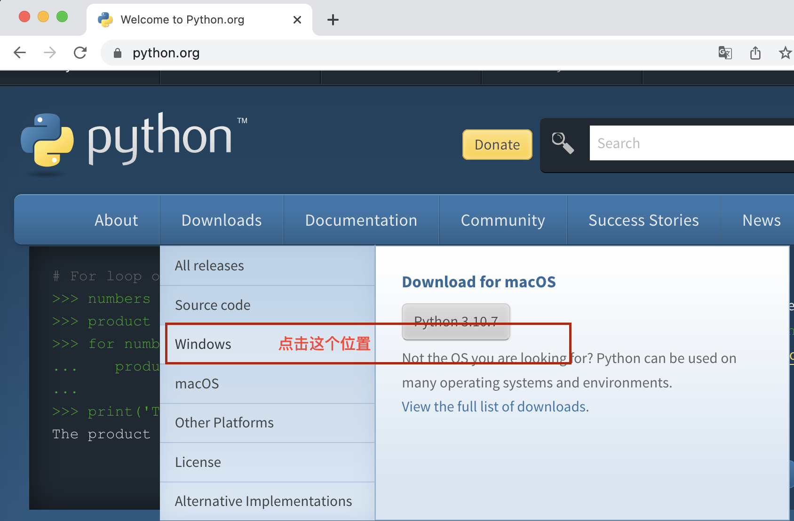
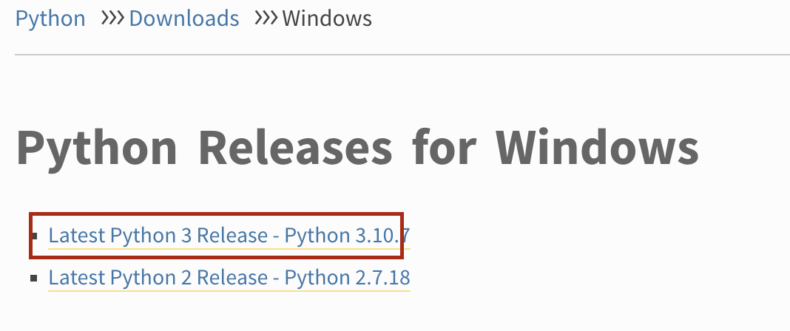
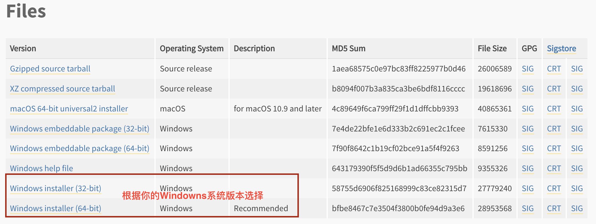
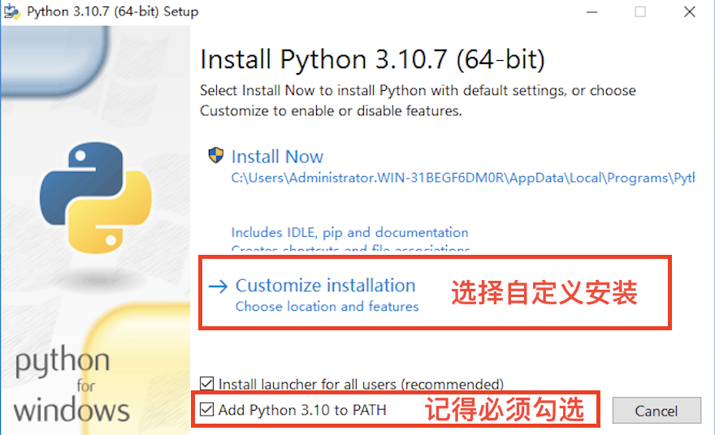
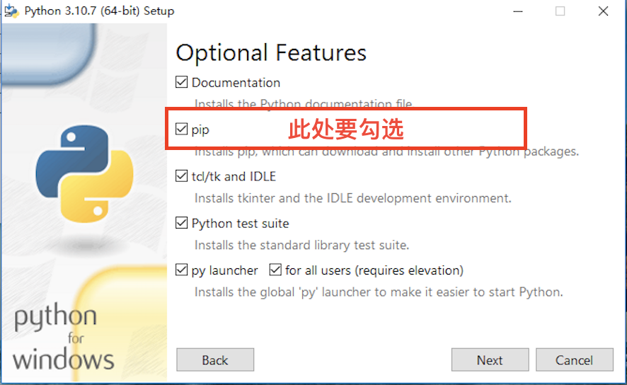
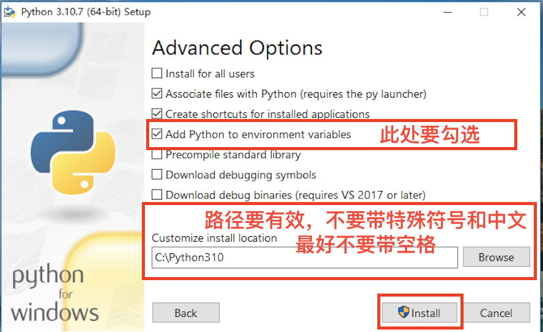
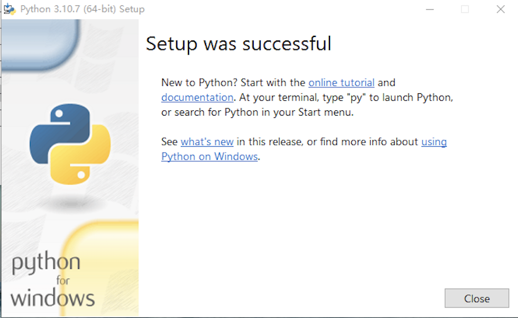
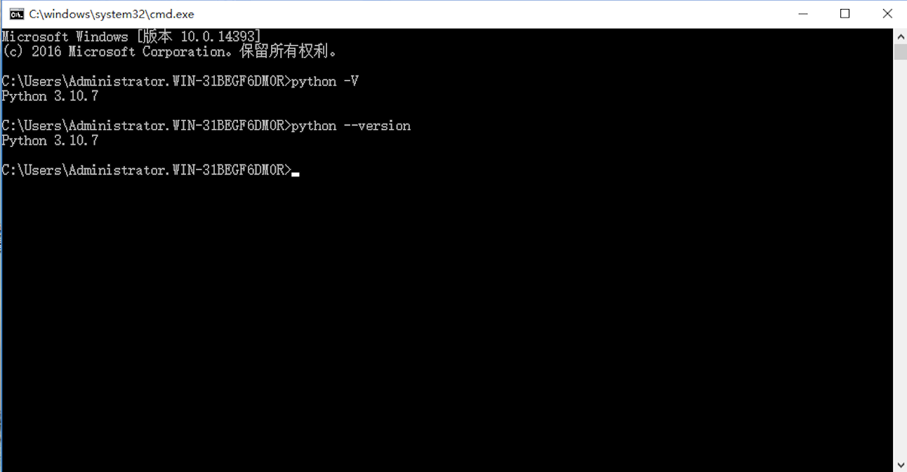

## Python简介

Python是一门简单，易学, 开源的高级语言

 - 学习难度低，不需要太高的基础
 - 解释型语言，可移植性高，不需要考虑机器的差异
 - 代码规范性高，可读性强
 - 面向对象语言，函数式编程
 - 生态圈强大，可应用的领域有软件开发、后端开发、数据科学、人工智能、机器学习、数据采集等

在正式学习之前, 给各位同学提几个建议
 - 学习过程中，尽量用英语表达各种输出
 - 多做练习
 - 不要怕犯错，学会理解解释器抛出的各种异常信息
 - 遇到问题时，先自己想办法找解决文案

 ### 安装Python

在开始学习Python编程之前，首先要在自己的计算机上安装Python的解释器环境。 Python的解释器有好多种，如IDLE、 VS Code、 Pycharm, Jupyter NoteBook等等。这里我们选择使用官方提供的解释器IDLE做为我们学习Python的环境。

#### Windows系统

Python的官方网站为[python.org](https://www.python.org/), 在登录之后，点击Download，并选择Windows。

这里我们选择Python3.x版本， 因为2.0版本已经不再更新维护，未来3.0版才是主流版本。

点击进入下一个页面之后，找到Files部分, 根据自己系统的版本选择32-bit还是64位的安装包。

这里也提供了两个安装包的下载链接，可以点击下载:

[32位Windows操作系统](https://www.python.org/ftp/python/3.10.7/python-3.10.7.exe)

[64位Windows操作系统](https://www.python.org/ftp/python/3.10.7/python-3.10.7-amd64.exe)

如何查看自己计算机系统版本是32位还是64位?

在计算机桌面下方的工具栏中点击开始菜单，在Windows系统文件夹下找到控制面板，并打开:
<image src="./images/StartMenu.png">

在控制面板里，依次点击【系统和安全】->【系统】，就能打开系统信息面板查看自己系统的信息。

<image src="./images/System.png">

<image src="./images/SystemSelection.png">

<image src="./images/SystemType.png">

下载好Python的编译器安装文件之后，双击打开Python环境的安装向导，选择自定义安装，切记一定要勾选“Add Python 3.X to PATH”，否则需要手动添加环境变量，会比较麻烦。

安装完成之后，打开Windows的***命令提示符***或者***PowerShell***, 输入`python -V`或者`python --version`，如果返回了Python解释器的版本，例如“Python 3.10.7”, 说明安装已经成功。

#### MacOS环境

MacOS系统是自带Python 2版本的，但是我们需要学习的是Python 3版本，可以参考上面的方法，在官方的[下载页面](https://www.python.org/downloads/macos/)找到对应的版本下载，并安装即可。
需要注意的是，在MacOS的***终端***直接执行`python`，调用的是Python 2版本的解释器。想要调用Python 3，必须输入`python3`。