# 第一个Python程序： hello, world

[上一章节](.././01.Python简介/Python简介.md)，我们了解了Python的特性和生态，也学会了如何在自己的计算机上安装Python的官方解释器。接下来我们正式开启Python编程的学习。

但：

<font size="4">**所有的代码编写必须都要用英文输入法！！！**</font>

<font size="4">**所有的代码编写必须都要用英文输入法！！！**</font>

<font size="4">**所有的代码编写必须都要用英文输入法！！！**</font>

重要的事情说三遍；除了字符串的内容，所有的编程语言必须用英文输入法编写代码，包括包围在字符串左右两边的引号（单引号和双引号）。

## IDLE

我们要使用的集成开发环境是官方提供的IDLE，在正式学习之后，要知道该怎么打开它。

点击 **【开始】** 菜单，找到安装的 **【Python 3.x】** 文件夹，点击 **【IDLE】** 打开它：

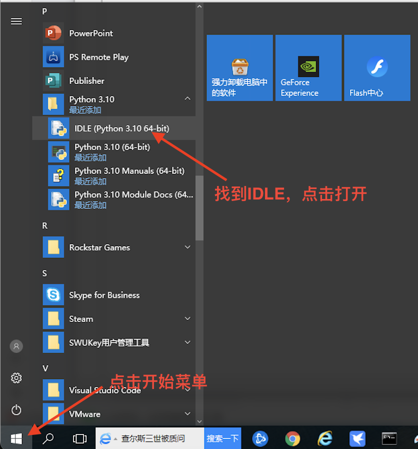

如下图，我们可以看到这个简单甚至简陋的Python自带的IDLE的界面；它会在本教程伴随我们一直到最后。

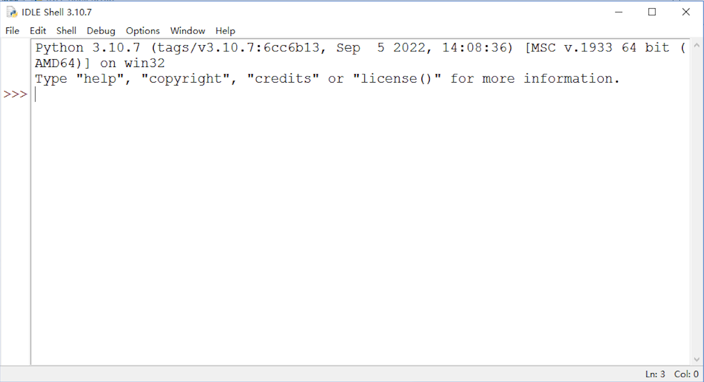

从IDLE的界面，我们可以看到Python的版本信息以及当前的运行环境信息，同时也有一些提示命令。
在上述信息的下方，我们看到`>>>`这样的符号，这个是Python语句输入的提示符，它的后面会有一光标在不停地闪烁，表示我们在该位置可以输入命令或者代码。

## hello, world

几乎在学习所有编程语言的最初，都会让我们先学会写一个简单的程序输出`hello, world`这样一句话，因为这段代码是伟大的丹尼斯·里奇（C语言之父，和肯·汤普森一起开发了Unix操作系统）和布莱恩·柯尼汉（awk语言的发明者）在他们的不朽著作The `C Programming Language` 中写的第一段代码。Python也并不例外，但是在Python中，不需要像有些语言那样先构造一个复杂的语法结构，我们只需要下面一行代码就可以实现：

```Python
print("hello, world")
```

IDLE给我们提供了两种编程环境，帮助我们去学习Python语言，它们分别是***交互式环境***和***文本编辑环境***，我们下面结合这两种编程环境的介绍，来完成我们在Python中的第一个程序。

### 交互式环境

交互式环境的意思就是，我们输入了一行代码，敲击回车键之后，代码会马上被执行, 如果执行的代码有结果生成，那么这个结果会直接显示在窗口里。

我们打开IDLE之后所看到的界面就是一个交互式环境，我们可以在输入提示符之后，输入代码再回车(#后面的内容不需要输入)：

```Python
>>>print("hello, world") #输入完成后敲回车
#下面一行为输出的结果
hello, world
```

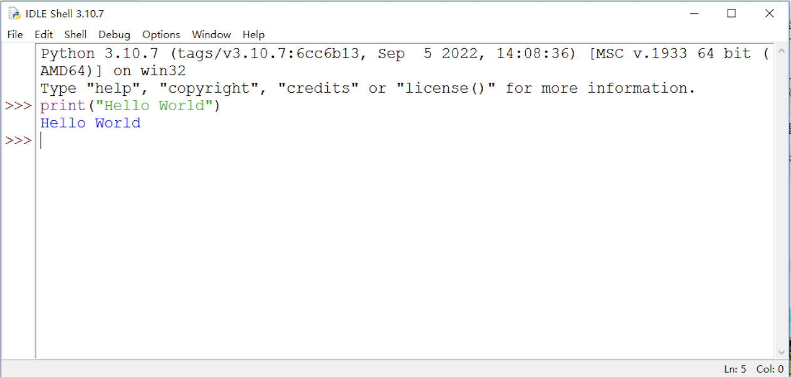

这里需要注意的是，我们只能在最后一个输入提示符`>>>`之后输入代码，即使在这之前有很多个`>>>`并没有我们输入的内容，就算是把光标移过去也是不可以的。

交互式环境的编程有很大的局限性，因为他每次只能写一行代码，或者是一个代码块，当我们要写的程序行数很多的时候就会很麻烦，一旦写的代码有错误，不能回去修改，只能重写。但是交互式编程并不是不可取的，它能够快速把代码执行的结果反馈出来，在这一点上是很便利的。

### 文本编辑环境

文本编程是指在文本编程器中编写代码并保存成文件之后，通过编程器编译成可执行的程序文件，或者通过解释器直接执行该程序文件的一种编程方式，文本编程也可以被叫作脚本式编程或者文件式编程，这种编程方式要求代码必须编写成一个纯文本文件，不能含有除了代码之外的任何信息。所以它对编辑文本的工具软件是有要求的，比如Windows系统中自带的*记事本*就可以进行代码的编写，然而*写字板*或者Office套件中的*Word*就不可以，因为这两种软件保存的文件中包含了其它除代码之外的内容。

IDLE中同样提供了这样的文本编辑环境，可以根据下列步骤进行操作：

1. 在IDLE的菜单栏中，选择 **【File】**, 然后点击 **【New File】** 打开一个文件编辑窗口:
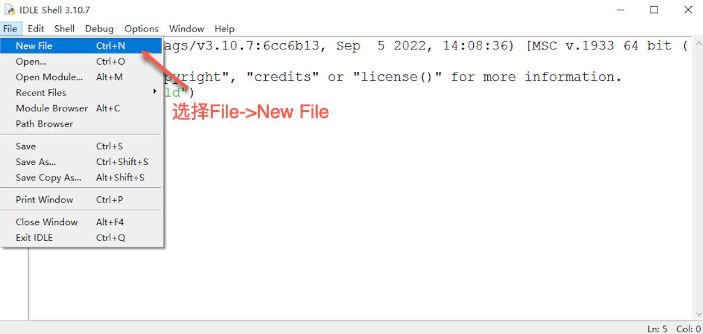

2. 在打开的文件编辑窗口之后，输入代码 `print("hello, world")`：
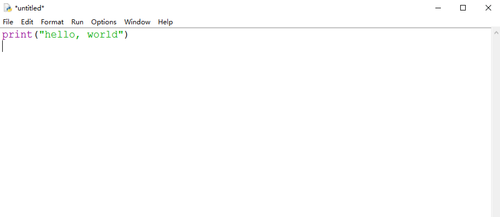

3. 完成代码编写之后，保存文件，在菜单栏中 **【File】**, 然后点击 **【Save】**，然后输入保存的文件名字，一定要注意 **【保存类型】** 一定是 **Python files(*.py;*.pyw,*.pyi)** :
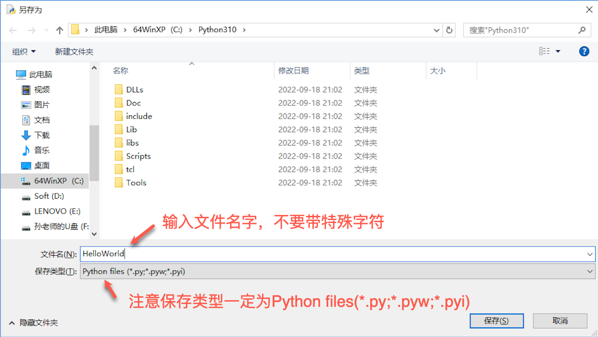

4. 保存好文件之后，就可以运行程序了，在菜单栏中选择 **【Run】**, 然后点击 **【Run Module】** 就可以了，该操作的快捷键为 **F5**:
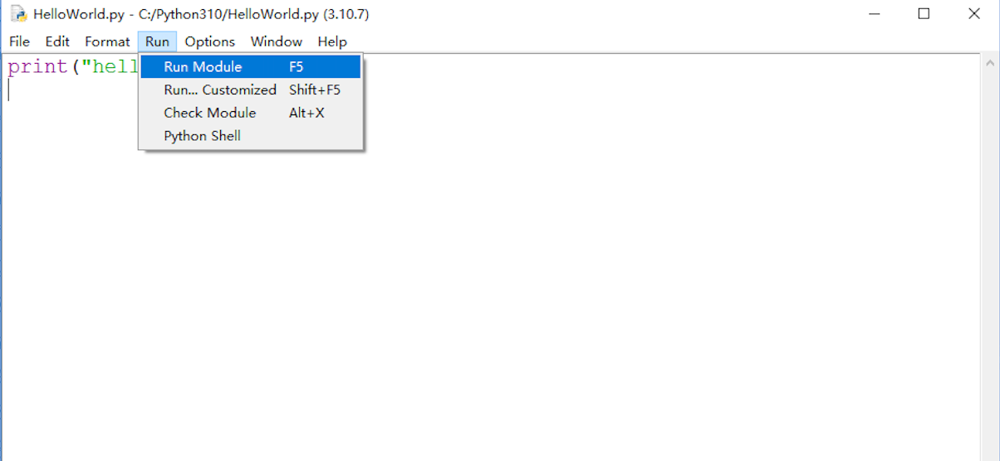

5. 运行完成之后，结果会输出在IDLE中：
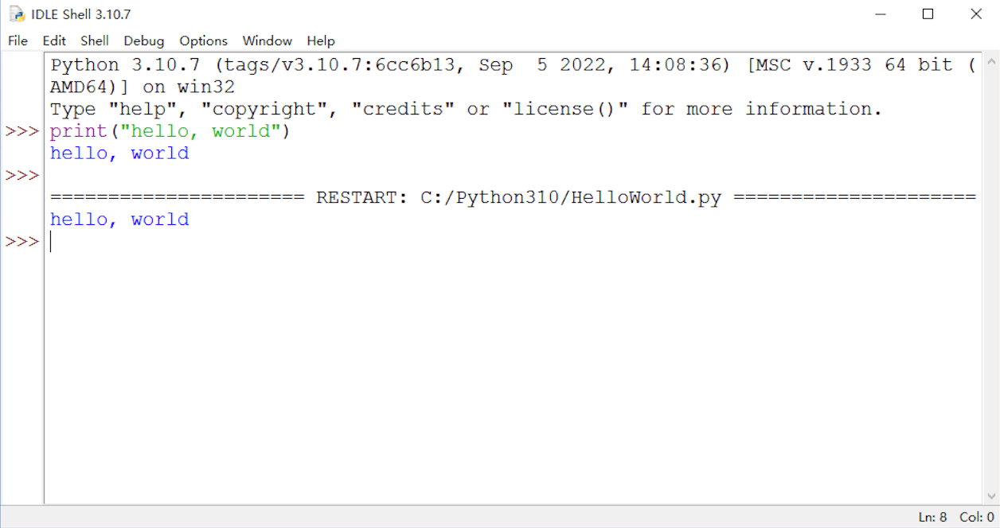

文本式编程是一种比较灵活的编程方式，一旦我们编写完代码运行之后发现了错误，就可以重新打开文件去修改：

1. 在菜单栏中，选择 **【File】**，点击 **【Open】**:
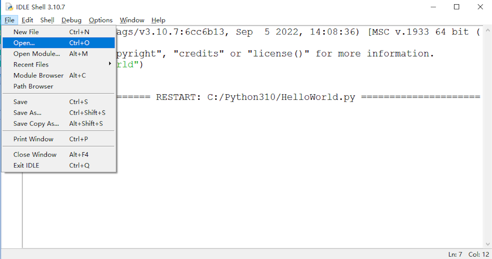

2. 选择要打开的文件:
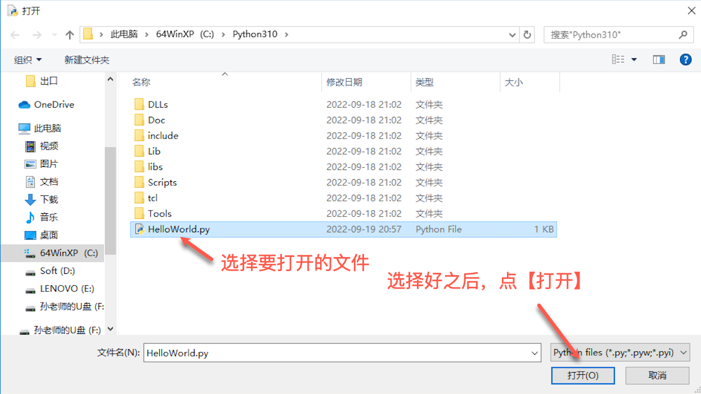

3. 修改代码，之后再运行即可：
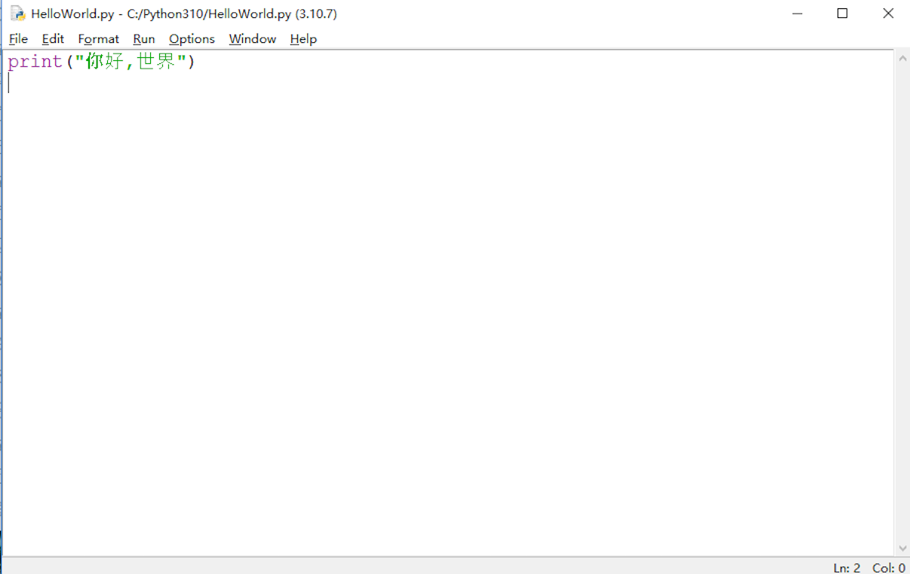


对于一个的程序员来讲，找到一个强大的集成开发环境是必不可少的先决条件。目前有几款比较流行的集成开发工具都支持Python编程，比如微软的***Visual Studio Code*** (简称***VS Code***)，或者[JetBrains](https://www.jetbrains.com/)的***PyCharm***， 这些都是很强大且专业的工具。

有兴趣的同学可以点击下列链接了解上述提到的工具：

[VS Code下载链接](https://code.visualstudio.com/)

[Pycharm下载链接](https://www.jetbrains.com/pycharm/download/)


## 总结

我们已经把第一个Python程序运行起来了，同时出了解了两种不同的编程环境。同学们可以自由发挥，用`print`函数输出一些其它内容，注意要用引号引上。

可以尝试把下列代码通过文本式编程编写并运行，看看我们能看到什么？
注：两个`"""`之间的内容可以不用写， 且不要直接复制粘贴到交互式的环境中！

```Python
"""
第一个海龟画图程序：
1. 注意语句的缩进
2. 可以把range后面括号里的值改成其它数值
3. 可以把left后面括号里的值改成其它数值
4. 可以把left替换成right
"""
import turtle as t

colors = ['red', 'green', 'orange', 'blue']

for i in range(100):
    t.color(colors[i%4])
    t.forward(i)
    t.left(90)
```
