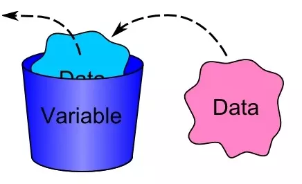

## 类型和变量

一个计算机程序是由**算法**+**数据结构**组成，在我们编写完程序之后，在运行它之前，它仅仅是一段静态的代码，只是步骤和方法的描述，并没有真正地帮我们解决问题。只有在运行起来之后，才能开始做事情，就像一副写在书上的《西红柿炒鸡蛋》的菜谱，我们光去看它是没有用的，只有我们买好原材料（西红柿和鸡蛋）之后，去厨房真正地去做它才能最终吃到好吃的西红柿炒鸡蛋。

细心的同学应该已经发现了，如果把程序比做菜谱，那么原材料（西红柿和鸡蛋）又应该是什么的比喻呢？**实际上讲，我们编写的程序就是为了用来处理数据**, 上一段中提到的原材料就是数据的比喻，而当程序运行起来并开始处理数据之后，它就从静态变为了动态，那么这个动态运行活动就叫做进程：

***进程 = 程序 + 数据***<br/>
***process = program + data***<br/>
或者<br/>
***进程 = 算法 + 数据结构 + 数据***<br/>
***process = algorithm + data structure + data***

那么什么是数据呢？你可能第一个想到的就是数学里学到的数值，如1，2，3...43.23，50，1000等等， 其实你的理解并不是错的，只是仅仅列出了数据的其中一种类型。

计算机中的数据不仅仅是狭义上的数字，还可以是具有一定意义的文字，字母，数字符号的组合、图形、图像、音频、视频等等。总之，根据百度百科的解释，数据是事实和观察的结果，是对客观事物的逻辑归纳，是用来表示客观事物的未经加工的原始素材。

每一种编程语言都有自己内建的基本数据类型，所以我们学习Python的第一个重要的内容就是**基本数据类型**。

### 基本数据类型Basic DataTypes

#### 整型int

整型，英文为`integer`，是指没有小数部分的数值型数据，比如1，2，3，100，44221等等，但是1.0， 2.0， 10.0这些数值则不是整型，因为它们都带有小数部分，即使他们和整数部分的值大小相等。一个`integer`是集合 Z = {..., -2, -1, 0, 1, 2, ...} 中的一个数。在Python中，用`int`来表示整型的类型名，它是Python中唯一的一个整型类型，可以处理任意大小的整数。

可以在IDLE中直接输入一个整型数据，再回车:

```Python
>>>1
1
>>>2
2
>>>100
100
>>>888888888888888888888
888888888888888888888
```

Python中同样可以支持二进制、八进制和十六进制的表示法，如0b1000(二进制，换算成十进制为8)，0o742(八进制，换算成十进制为482)， 0xFAE(十六进制，换算成十进制为4014)。其中`0b`、`0o`和`0x`分别为二进制、八进制和十六进制的前缀，如果不写的话，二进制和八进制会被当做十进制处理，十六进制则会报错。

```Python
>>>0b1000
8
>>>0o742
482
>>>0xFAE
4014
```


#### 浮点型float

浮点型，英文为`float`，是指具有小数部分的数值型数据，比如1.414、3.1415926、2.718281828459045、4.000等等。在Python中，用`float`来表示浮点型的类型名，它是Python中唯一的一个浮点型类型，可以处理任意精度的浮点数。

```shell
>>>1.414
1.414
>>>3.1415926
3.1415926
>>>2.718281828459045
2.718281828459045
>>>4.000
4.0
```

Python中的浮点型支持十进制和指数型两种表示法，指数型也叫科学记数法，属于超纲内容，这里就不做过多介绍了，感兴趣的同学可以自行研究一下。


#### 字符串str

字符串，英文为`string`，是指由文字、字母、数字以及一系列符号组成的一串字符，这些字符由单引号或者双引号括起来，比如“abc”、‘banana’、‘1000’等等。在Python中，用`str`来表示字符串的类型名。需要特别注意的是，只要用引号括起来之后，就是字符串，即使里面的字符看起来看是一个整型或者浮点型。

```Python
>>>“abc”
'abc'
>>>'banana'
'banana'
>>>'1000'
'1000'
```

如果在字符串中需要用到引号(`"`或`'`)的话，可以用转义的方式(`\'`或`\"`)，或者在需要用到单引号的时候，用双引号把字符串括起来，反之亦然:

```Python
>>>'I\'m a student.'
"I'm a student."
>>>"I\'m a student."
"I'm a student."
```

#### 布尔型bool

布尔型，英文为boolean，用来描述真假的一种数据，也叫逻辑型，它只有两个值: `True` 和 `False`。这里要注意一定是只有首字母大写，如果写成了true、flase、TURE或者是FaLSe都是错误的。在Python中，用`str`表示布尔型的类型名。

```Python
>>>True
True
>>>False
False
```

如果输入错误，会报错，如输入`true`:

```shell
Traceback (most recent call last):
  File "<stdin>", line 1, in <module>
NameError: name 'true' is not defined
```

在Python中，`bool`类型其实是`int`类型的子类型，一般情况下，`False`就是`0`, `True`就是`1`；但是所有的非0的数值都可以认为是真，这一点我们之后再详细说明。


#### 空值None

空值，英文为`None`，是Python中一个很特殊的类型，它只有一个值，即`None`，表示空对象，什么都没有。但是数据为空并不是空值，比如空字符串`""`，它是字符串类型，并不是空值类型。在Python中，用`NoneType`表示空值的类型名。

```Python
>>>None
>>>
>>>""
''
```

空值并不是一个没有意义的类型，相反，需要用到它的地方有很多。比如，调用函数的时候，不想给某个参数传递值，但是这个参数没有默认的值，所以传值是必须的，那么就可以把空值传给它。关于这一点，我们以后遇到的时候，结合实际用法就可以理解得更好。


### 变量Variables

也许你已经在数学中学习过了有关未知数的概念，那么你对变量已经有了初步的接触，如下面的方程：

\\[5x+(4 \times 5)-19=46\\]

我们可以经过解方程得到\\(x\\)的值为9，然而这里的\\(x\\)是一个固定的值，在解方程之前它只是个未知数，只有解开方程之后才知道它的值是多少。

然而，Python中变量更像是初中要学习的函数里的定义域:

\\[ y=x^2+2x+1 \\]

或者

\\[ f(x)=x^2+2x+1 \\]

这里的\\(x\\)是一个变化的值，随着\\(x\\)的变化，\\(y\\)或者函数\\(f(x)\\)的值也会变化。但实际上，这里的\\(x\\)更加准确的概念应该是参数(parameters)，参数和变量还是不同的，参数是要配合函数来一起使用的，但是变量是独立的，可以单独去发挥作用。

在计算机编程中，变量就是一个数据的载体，也就是一块用来保存数据的内存空间，它可以被读取和修改。一个变量有两个最基本的要素:**名字**和**类型**。

我们可以把变量想像成一个用来存放数据的容器，像下图一样:



他在内存中的表现是这样的:

<svg width="380" height="255" xmlns="http://www.w3.org/2000/svg">
 <g>
  <title>Layer 1</title>
  <path stroke="#000" fill="#fff" stroke-width="3" d="m163.49998,41.5l185.00002,0l0,171.3948c-92.50001,0 -92.50001,65.30456 -185.00002,28.1997l0,-199.5945z" id="svg_2"/>
  <rect stroke="#000" fill="#fff" stroke-width="3" x="178.5" y="70.5" width="71" height="24" id="svg_3"/>
  <text fill="#000000" stroke="#000" stroke-width="0" x="227" y="27.5" id="svg_9" font-size="24" font-family="Noto Sans JP" text-anchor="start" xml:space="preserve">内存</text>
  <text fill="#000000" stroke="#000" stroke-width="0" x="177.5" y="63.5" id="svg_10" font-size="18" font-family="'Stick No Bills'" text-anchor="start" xml:space="preserve">存储单元</text>
  <text fill="#000000" stroke="#000" stroke-width="0" x="262.5" y="63.5" id="svg_11" font-size="18" font-family="'Stick No Bills'" text-anchor="start" xml:space="preserve">地址</text>
  <text fill="#000000" stroke="#000" stroke-width="0" x="255.5" y="87.5" id="svg_11" font-size="12" font-family="'Stick No Bills'" text-anchor="start" xml:space="preserve">0xADA43B01</text>
  <text fill="#000000" stroke="#000" stroke-width="0" x="255.5" y="116.5" id="svg_11" font-size="12" font-family="'Stick No Bills'" text-anchor="start" xml:space="preserve">0xADA43B02</text>
  <text fill="#000000" stroke="#000" stroke-width="0" x="255.5" y="144.5" id="svg_11" font-size="12" font-family="'Stick No Bills'" text-anchor="start" xml:space="preserve">0xADA43B03</text>
  <text fill="#000000" stroke="#000" stroke-width="0" x="255.5" y="171.5" id="svg_11" font-size="12" font-family="'Stick No Bills'" text-anchor="start" xml:space="preserve">0xADA43B04</text>
  <path stroke="#000" stroke-width="3" fill="#fff" d="m30.02751,73.32114l21.56375,-30.54866l86.43623,0l0,152.99999l-107.99998,0l0,-122.45133l0,0.00001z" id="svg_12"/>
  <text style="cursor: move;" fill="#000000" stroke="#0" stroke-width="3" x="56.5" y="27.5" id="svg_13" font-size="24" font-family="'Syne'" text-anchor="start" xml:space="preserve">程序</text>
  <text fill="#000000" stroke="#0" stroke-width="3" x="44.5" y="91.5" id="svg_16" font-size="18" font-family="'Stick No Bills'" text-anchor="start" xml:space="preserve">a = 1</text>
  <text fill="#000000" stroke="#0" stroke-width="3" x="189.5" y="87.5" id="svg_17" font-size="12" font-family="'Stick No Bills'" text-anchor="start" xml:space="preserve">00000001</text>
  <rect stroke="#000" fill="#fff" stroke-width="3" x="178.5" y="98.5" width="71" height="24" id="svg_1"/>
  <rect stroke="#000" fill="#fff" stroke-width="3" x="178.5" y="126.5" width="71" height="24" id="svg_4"/>
  <rect stroke="#000" fill="#fff" stroke-width="3" x="178.5" y="154.5" width="71" height="24" id="svg_5"/>
  <text xml:space="preserve" text-anchor="start" font-family="'Stick No Bills'" font-size="18" id="svg_6" y="197.5" x="204" stroke-width="0" stroke="#0" fill="#000000">......</text>
  <text xml:space="preserve" text-anchor="start" font-family="'Stick No Bills'" font-size="18" id="svg_7" y="197.5" x="273" stroke-width="0" stroke="#0" fill="#000000">......</text>
  <path transform="rotate(88.93 138.778 85.4919)" stroke="#0" id="svg_14" d="m132.57303,85.39116l6.20516,-41.88579l6.20516,41.88579l-3.10258,0l0,42.08734l-6.20516,0l0,-42.08734l-3.10258,0z" stroke-width="3" fill="#000000"/>
 </g>

</svg>

上图中的`a`就是变量的名字，在Python中，变量的类型不是在声明它的时候给出，而且会根据我们赋给它的值变化，比如`a = 1`，这时变量`a`的类型是整型`int`，如果我们重新给它赋值`a="apple"`，那它的类型就变成了字符串`str`；我们也可以通过一些内建函数来改变它的类型，这一点我们后面很快就会讲到。

#### 变量命名

每一个变量都需要提前定义，首先要给它取一个名字，方便我们在后面使用它。变量的命名是要遵循下列规则的：
- 变量的名字由字母、下划线`_`和数字组成，但是不能以数字开头。这里的字母不单单是26个英文字母，它指的是在Unicode(也被称作万国码)字符集里的所有字母，包括中文、英文、日文、希腊字母、德文等等，范围非常广，但是像`@`、`#`、`$`这些字符是不能出现在变量名中的，我们强烈建议起名的时候只用英文字母。
- 变量的名字是大小写敏感的，比如`A`和`a`是两不同的变量。
- 变量的名字不要使用Python中已经保留的关键字，也不要用自定义的函数、类名。

我们可以通过下面的方式查看Python中有哪些保留的关键字:

```Python
>>>import keyword
>>>keyword.kwlist
['False', 'None', 'True', '__peg_parser__', 'and', 'as', 'assert', 'async', 'await', 'break', 'class', 'continue', 'def', 'del', 'elif', 'else', 'except', 'finally', 'for', 'from', 'global', 'if', 'import', 'in', 'is', 'lambda', 'nonlocal', 'not', 'or', 'pass', 'raise', 'return', 'try', 'while', 'with', 'yield']
```

有关我自定义函数和类名的限制，我们以后会讲到。

#### 变量赋值

可以通过执行赋值表达式来修改变量中存储的值，Python中的赋值运算符为`=`，这个等号并不是我们数学上的“等于”，千万不要混淆。给变量赋值的语法为:

***变量 = 值***<br/>
***变量 = 变量***<br/>
***变量 = 表达式***</br>
***变量 = 函数返回值***<br/>

在赋值的时候，变量**永远要写在左边**，右边是要赋与它的值。

```Python
>>>a = 1 #直接用值给变量赋值
>>>print(a)
>>>1
>>>b = a #用变量的值给变量赋值
>>>print(b)
>>>1
>>>c = a + b #用表达式给变量赋值
>>>print(c)
>>>2
>>>a = a + 1 #同样是用表达式给a赋值
>>>print(a)
>>>2
>>>d = str(a) #用函数返回值给变量赋值
>>>print(d)
>>>'2'
```

看到上面的例子，你是不是对于`a = a + 1`不太理解？没关系，我来给你解释：

赋值表达式在执行过程中，是先要执行赋值符`=`右边的代码的，当右边的代码执行完并得到结果之后，就会把这个结果赋值给赋值符`=`左边的变量。所以在`a = a + 1`中，最初变量`a`存储的值为`1`，先是使用了变量`a`，把它加了1之后得到`2`，再把字面量值`2`重新赋值给了变量`a`。

总之，变量是一种方便使用的占位符，用于引用计算机的内存地址来存储值。