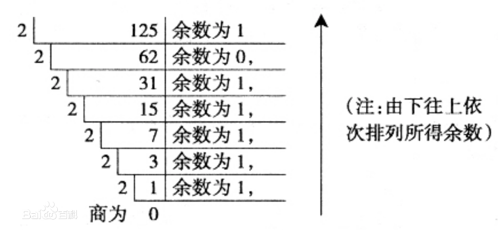
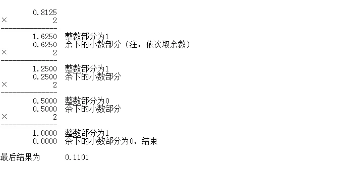

## 位运算

程序中的所有数在计算机内存中都是以二进制的形式储存的。位运算就是直接对整数在内存中的二进制位进行操作。所以要先了解二进制。

另:本章节详细分析部分有一定难度，建议只学习位运算符的使用方法即可。

### 二进制

17世纪至18世纪的德国数学家莱布尼茨，是世界上第一个提出二进制记数法的人。用二进制记数，只用`0`和`1`两个符号，无需其他符号。这一计数方法充分结合了数字电子电路系统的高低电平，在一些系统中，高电平表示`1`，低电平表示`0`，而有的系统则是高电平表示`1`，低电平表示`2`。这也是为什么低级语言编写的程序不能跨平台使用的原因。下面两个图可以简单表示两种不同系统的高低电平情况:


#### 进制转换

**十进制转二进制**

一个十进制数转换为二进制数要分整数部分和小数部分分别转换，最后再组合到一起。

整数部分采用 "除2取余，逆序排列"法。具体做法是：用2整除十进制整数，可以得到一个商和余数；再用2去除商，又会得到一个商和余数，如此进行，直到商为小于1时为止，然后把先得到的余数作为二进制数的低位有效位，后得到的余数作为二进制数的高位有效位，依次排列起来。例：125:



经过运算，十进制的`125`，转换成二进制之后为`1111101`。

小数部分要使用“乘2取整法”。即用十进制的小数乘以2并取走结果的整数(必是 0或1)，然后再用剩下的小数重复刚才的步骤，直到剩余的小数为0时停止，最后将每次得到的整数部分按先后顺序从左到右排列即得到所对应二进制小数。例如，将十进制小数 0.8125 转换成二进制小数过程如下:



**二进制转十进制**

二进制转换成十进制是要按位进行\\(2^{x-1}\\)运算，再加到一起，比如:

\\[(111111)_2 = 2^5 + 2^4 + 2^3 + 2^2 + 2^1 + 2^0 = 63\\]

或:

\\[(101011)_2 = 2^5 + 2^3 + 2^1 + 2^0 = 43\\]

### 位运算 Bitwise

<table><thead><tr><th align="left">运算符</th><th align="left">说明</th></tr></thead><tbody>
<tr><td align="left"><code>~</code></td><td align="left">按位取反</td></tr>
<tr><td align="left"><code>>></code>&nbsp;&nbsp;<code><<</code></td><td align="left">右移&nbsp;&nbsp;左移</td></tr>
<tr><td align="left"><code>&amp;</code></td><td align="left">按位与</td></tr>
<tr><td align="left"><code>^</code>&nbsp;&nbsp;<code>|</code></td><td align="left">按位异或、按位或</td></tr>
</tbody></table>

#### 按位取反

按位取反运算符：对数据的每个二进制位取反,即把1变为0,把0变为1:

```Python
>>>~6
-7
>>>~-8
7
```

`~x` 类似于 `-x-1`，但是实际情况远远要复杂得多，有兴趣的同学可以查看附录进行学习[附录-按位取反](../附录/appendix.md#按位取反)


#### 左移、右移

位运算中，左移`n`位相当于原数整除`2n`，左移`n`位相当于原数乘以`2n`，但是位移运算效率更高。

```Python
>>>15>>2
3
>>>15<<2
60
```

假设我们的一台简易计算机只用一个字节(byte，即8位)来存储数值，那么`15`的二进制应该为`0000 1111`，所以左移2位之后变为`0000 0011`，即`3`; 左移2位之后变成`0011 1100`，即`60`。


#### 按位与

按位与运算是将两个数值的二进制按位进行逻辑与运算，只有同时为`1`时才能得到`1`，否则结果都是`0`。

```Python
>>>15 & 24
8
```

||||||||||
|---|---|---|---|---|---|---|---|---|
|15: |0|0|0|0|1|1|1|1|
|24: |0|0|0|1|1|0|0|0|
|&|0|0|0|0|1|0|0|0|


#### 按位或

按位或运算是将两个数值的二进制按位进行逻辑或运算，只有同时为`0`时才能得到`0`，否则结果都是`1`。

```Python
>>>15 | 24
31
```

<table><thead><tr><th></th><th></th><th></th>
<th></th>
<th></th>
<th></th>
<th></th>
<th></th>
<th></th></tr></thead><tbody>
<tr><td>15:</td>
<td>0</td>
<td>0</td>
<td>0</td>
<td>0</td>
<td>1</td>
<td>1</td>
<td>1</td>
<td>1</td>
</tr>
<tr><td>24:</td>
<td>0</td>
<td>0</td>
<td>0</td>
<td>1</td>
<td>1</td>
<td>0</td>
<td>0</td>
<td>0</td>
</tr>
<tr><td>|</td>
<td>0</td>
<td>0</td>
<td>0</td>
<td>1</td>
<td>1</td>
<td>1</td>
<td>1</td>
<td>1</td>
</tr>
</tbody></table>

#### 按位异或

按位异或运算是将两个数值的二进制按位进行逻辑异或运算，当值相同是得到`0`，不同时则得到`1`。

```Python
>>>15 | 24
23
```

||||||||||
|---|---|---|---|---|---|---|---|---|
|15: |0|0|0|0|1|1|1|1|
|24: |0|0|0|1|1|0|0|0|
|^|0|0|0|1|0|1|1|1|


### 总结

位运算是计算机编程中很重要的一种运算方式，这里我们暂时了解这些就足够了。