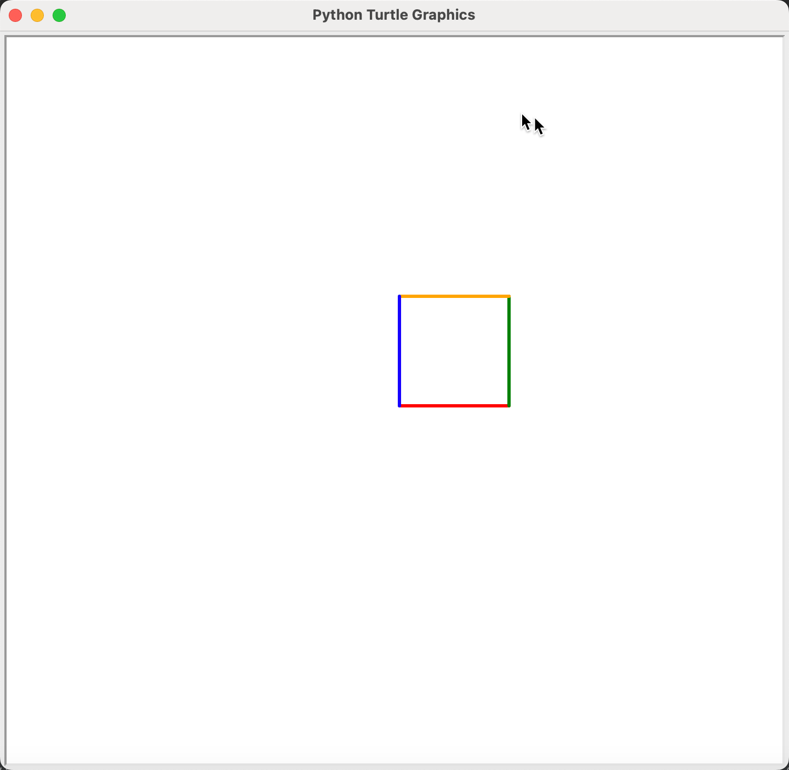
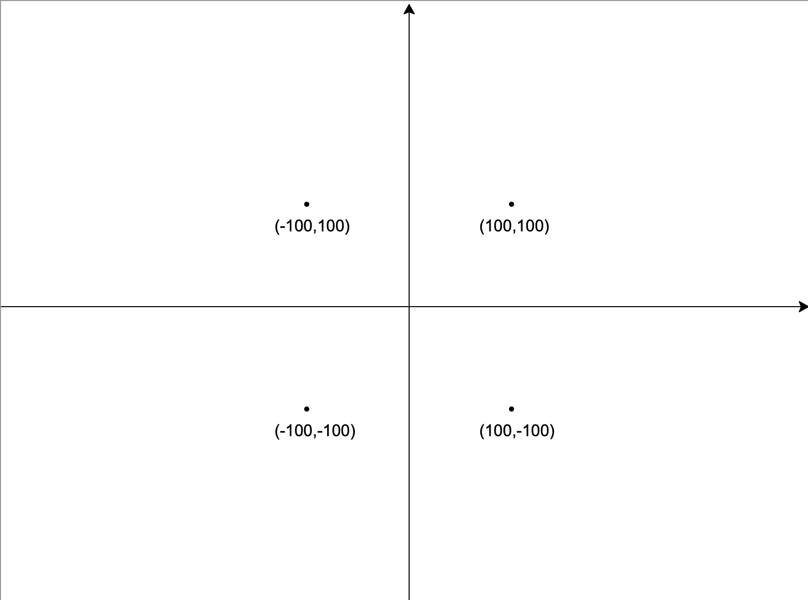
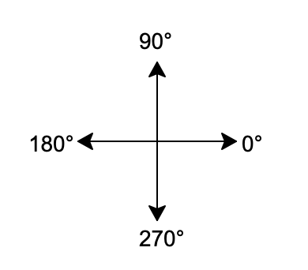
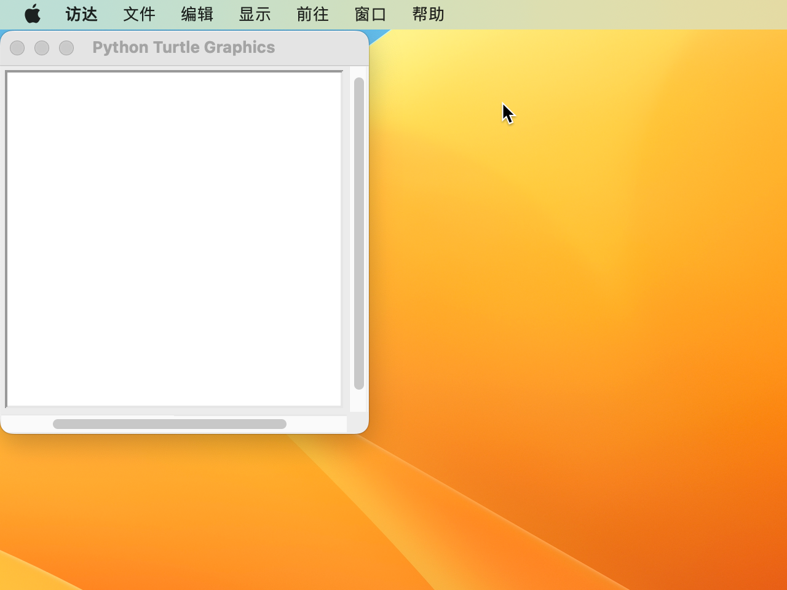
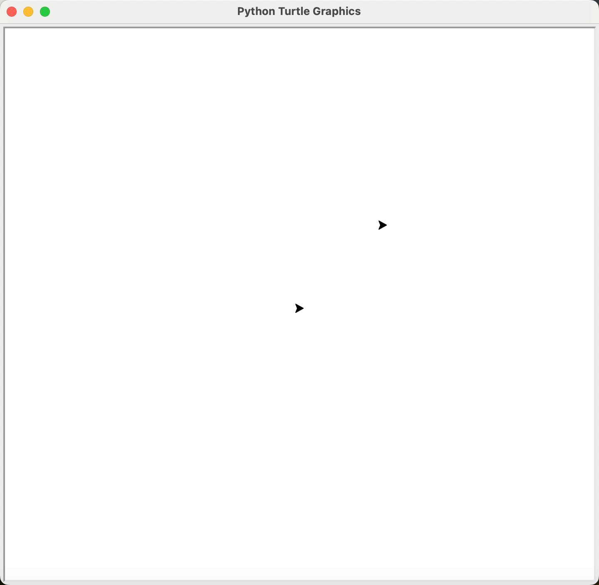
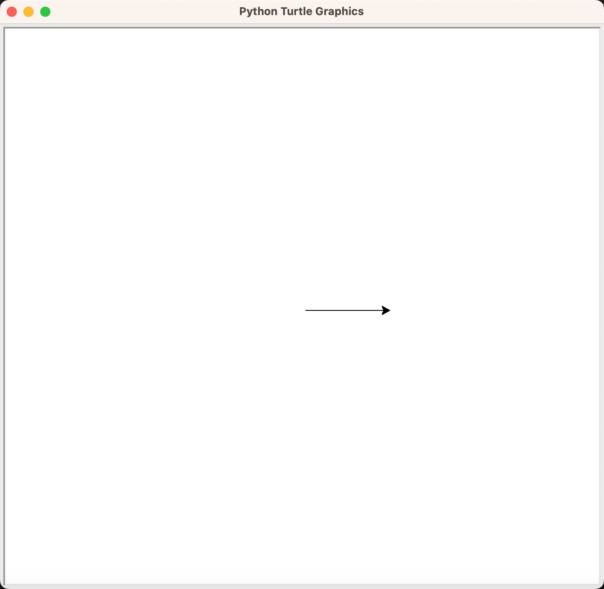
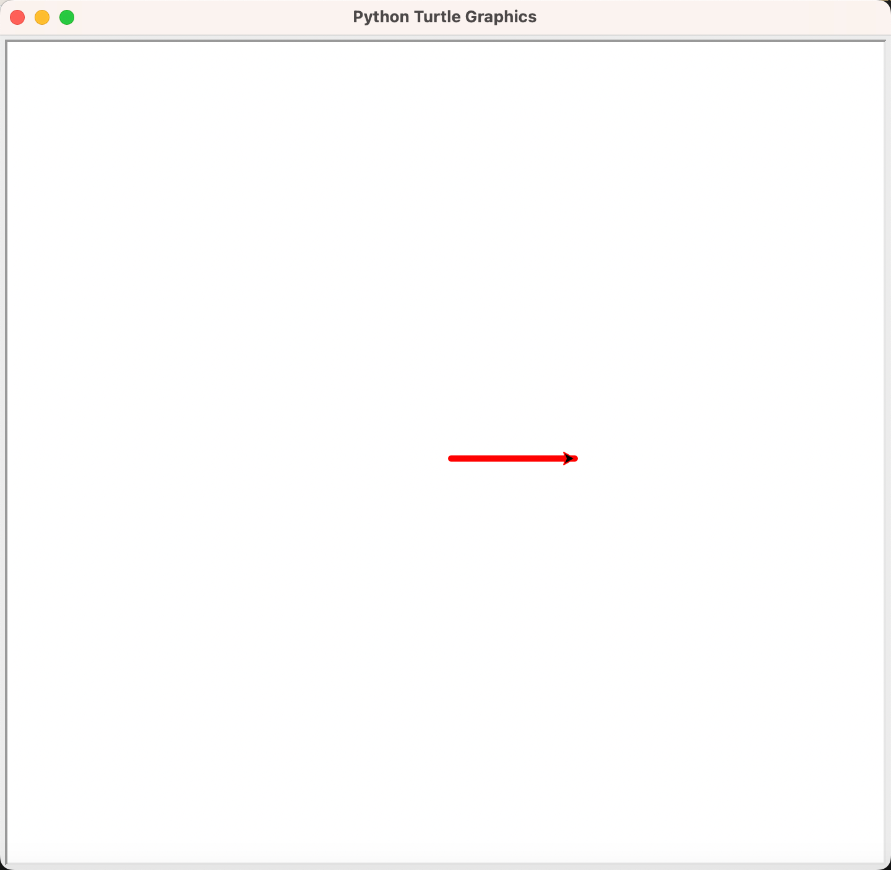

## 海龟画图

海龟画图(Turtle Graphics)是`Python`的内建模块，它移植于LOGO语言，这门语言是在1966由Seymour Papert 和 Wally Feurzig 为了专门给儿童学习编程发明出来的，它的特色就是通过编程指挥一个小海龟（Turtle） 在屏幕上绘图。

我们先通过下面简单代码对海龟画图有个初步认识

```Python
import turtle as t

"""
author: 孙老师
功能: 画一个正方形
"""

t.pensize(3)

t.pencolor("red")
t.forward(100)
t.left(90)

t.pencolor("green")
t.forward(100)
t.left(90)

t.pencolor("orange")
t.forward(100)
t.left(90)

t.pencolor("blue")
t.forward(100)
t.left(90)
```

运行上述代码之后，弹出绘画窗口，并画出一个正方形：


### 导入模块

由于`turtle`是`Python`中的内置模块，在使用之前需要先用`import`关键字来导入，导入模块有三个方式：

```Python
# 方式1：导入模块
import turtle
# 方式2：导入模块并起别名
import turtle as t
# 方式3：批量导入资源
from turtle import *
```

- 使用第一种方式时，在调用模块中的资源时，用`turtle.`的方式即可，例如`turtle.forward(100)`。
- 使用第二种方式时，在调用模块中的资源时，用`t.`的方式即可，例如`t.forward(100)`。
- 使用第三种方式时，可以直接用资源的名字调用，不需要加任何前缀，例如`forward(100)`。

这里，我们建议用第二种方式，不建议第一种方式的原因是有些模块的名字会很长，在编写代码时应用不太方便；而第三种方式会导致程序在运行过程中出现异常，因为在不同的模块内的资源名字有重名发生，会导致歧义。


### 海龟的属性

海龟的属性主要有两个：***位置***和***方向***。

***位置***

在Python中，海龟的位置是由`x`和`y`两个信息组成的，它们分别表示海龟横纵坐标。我们以画布的最中心点为原点，分别在水平和垂直的方向画两条线，这样就画出类似于数学中的平面坐标系，如下图：



平面坐标系把整个画布分成了四个部分，也叫四个象限：
- 第一象限：位于坐标系的右上，`x`和`y`的值均为正数；
- 第二象限：位于坐标系的左上，`x`为负数，`y`为正数；
- 第三象限：位于坐标系的左下，`x`和`y`的值均为负数；
- 第四象限：位于坐标系的左上，`x`为正数，`y`为负数。

坐标的表示方式为`(x,y)`，如`(100,100)`、`(-43,32)`等。


***方向***

这里提到的方向指的就是**绝对方向**：
  0°：水平向右
 90°：垂直向上
180°：水平向左
270°：垂直向下



### 海龟的功能

海龟画图的功能有

|函数名|功能|
|:-------------------|:-------------------------------------|
|`setup()`|设置主窗口的尺寸和位置|
|`pensize()`|改变画笔的大小，单位为像素|
|`pencolor()`|改变画笔的颜色|
|`dot()`|画出一个点|
|`forward()`, `fd()`|延着海龟面对的方向向前移动|
|`backward()`, `bk()`|背对海龟面对的方向移动|
|`goto()`,`setpos()`,`setposition()`|设置海龟的坐标，让海龟从当前位置直接移动到指定坐标|
|`pos()`,`position()`|获取当前海龟的坐标|
|`down()`, `pendown()`, `pd()`|落笔，海龟移动时会留下痕迹|
|`up()`, `penup()`, `pu()`|抬笔，海龟移动时不会留下痕迹|
|`left()`,`lt()`|向左转动海龟，改变其方向|
|`right()`,`rt()`|向右转动海龟，改变其方向|
|`setheading()`,`seth()`|设置海龟的绝对方向|
|`circle()`|让海龟画圆或者画一段弧线，也可以画出正多边形|
|`fillcolor()`|设置填充颜色|
|`begin_fill()`|开始填充|
|`end_fill()`|结束填充|
|`color()`|改变画笔和填充颜色|
|`Pen()`|创建画笔|
|`hideturtle()`, `ht()`|隐藏画笔|
|`home()`|让海龟的位置回到(0,0)坐标|
|`reset()`|重置海龟的状态，并清除画布|

#### setup()

`setup()`函数有四个参数：

```Python
setup(width=0.5, height=0.75, startx=None, starty=None)
```

`width`和`height`设置主容器的宽和高，`startx`和`starty`设置主窗口在屏幕上的初始的位置。
当不调用`setup`函数时，默认主窗口的宽和高分别为屏幕的0.5和0.75，位置为正中央。

```Python
import turtle as t
t.setup(300, 300, 0, 0)
```



#### Pen()

在导入海龟之后，可以直接让海龟去画图，同时也可以用`Pen()`函数给海龟创建一个影分身和海龟一起来作画。调用这个函数时不需要传递任何参数。

```Python
import turtle as t
p1 = t.Pen()
p2 = t.Pen()

p1.pu()
p1.goto(100,100)
p1.pd()
```



#### pensize()和 pencolor()

`pensize()`函数改变画笔的粗细,默认粗细为1。
`pencolor()`改变画笔的颜色，默认颜色为黑色；传参数时，需要用有实际颜色涵义的英文字符串，如：

```Python
"red" "green" "yellow" "blue" "orange" "grey" "cyan" "white" ...
```

```Python
import turtle as t
t.forward(100)
```


```Python
import turtle as t
t.pensize(5)
t.pencolor("red")
t.forward(100)
```



#### dot()

`dot()`函数可以让海龟在画布上画上一个点，它有两个参数`size`和`color`:
- `size` 表示点的粗细，如果没给定一个值，那么画出的点的粗细取`pensize*2`和`pensize+4`之间的最大值。
- `color`表示点的颜色，传参数的要求和`pencolor`一下致。

