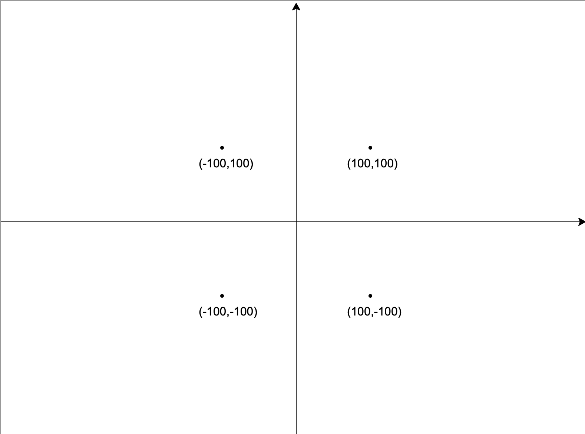
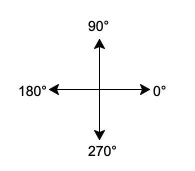
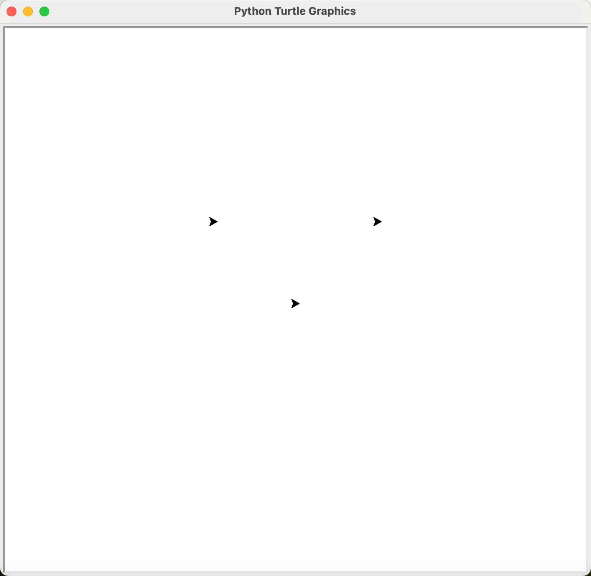

# 海龟画图-第二部分

海龟画图(Turtle Graphics)是`Python`的内建模块，它移植于LOGO语言，这门语言是在1967年由Seymour Papert， Wally Feurzig和Cynthia Solomon 为了专门给儿童学习编程发明出来的，它的特色就是通过编程指挥一个小海龟（Turtle） 在屏幕上绘图。<br>
在 Python 中，海龟绘图提供了一个实体“海龟”形象（带有画笔的小机器动物），假定它在地板上平铺的纸张上画出线条形成各种图形。

我们先通过下面简单代码对海龟画图有个初步认识

```Python
import turtle as t

"""
author: 孙老师
功能: 画一个正方形
"""

t.pensize(3)

t.pencolor("red")
t.forward(100)
t.left(90)

t.pencolor("green")
t.forward(100)
t.left(90)

t.pencolor("orange")
t.forward(100)
t.left(90)

t.pencolor("blue")
t.forward(100)
t.left(90)
```

运行上述代码之后，弹出绘画窗口，并画出一个正方形：

<div align="center">

</div>

<!---->

## 导入模块

由于`turtle`是`Python`中的内置模块，在使用之前需要先用`import`关键字来导入，导入模块有三个方式：

```Python
# 方式1：导入模块
import turtle
# 方式2：导入模块并起一个别名
import turtle as t
# 方式3：批量导入资源
from turtle import *
```

- 使用第一种方式时，在调用模块中的资源时，用`turtle.`的方式即可，例如`turtle.forward(100)`。
- 使用第二种方式时，在调用模块中的资源时，用`t.`的方式即可，例如`t.forward(100)`。
- 使用第三种方式时，可以直接用资源的名字调用，不需要加任何前缀，例如`forward(100)`。

**这里，我们建议用第二种方式，不建议第一种方式的原因是有些模块的名字会很长，在编写代码时应用不太方便；而第三种方式会导致程序在运行过程中出现异常，因为在不同的模块内的资源名字有重名发生，会导致歧义。**


## 海龟的属性

在让海龟画图之前，首先要了解海龟的三个属性，分别为：***位置***、***方向***和***颜色***。

### 位置

在Python中，海龟的位置是由`x`和`y`两个信息组成的，它们分别表示海龟横纵坐标。我们以画布的最中心点为原点，分别在水平和垂直的方向画两条线，这样就画出类似于数学中的平面坐标系，如下图：

<div align="center">

</div>

<!---->

平面坐标系把整个画布分成了四个部分，也叫四个象限：
- 第一象限：位于坐标系的右上，`x`和`y`的值均为正数；
- 第二象限：位于坐标系的左上，`x`为负数，`y`为正数；
- 第三象限：位于坐标系的左下，`x`和`y`的值均为负数；
- 第四象限：位于坐标系的左上，`x`为正数，`y`为负数。

坐标的表示方式为`(x,y)`，如`(100,100)`、`(-43,32)`等。


### 方向

这里提到的方向指的就是**绝对方向**：
-   0°：水平向右
-  90°：垂直向上
- 180°：水平向左
- 270°：垂直向下

即，只要当海龟的箭头指向水平向左，那边它的绝对方向就是`180°`。

<div align="center">

</div>

<!---->

需要提醒的是，水平向右的绝对方向为`0°`是模块中默认的情况，我们可以调用`mode()`函数来设置垂直向上的绝对方向为`0°`。请查看[海龟的绝对零度](../附录/appendix.md#海龟的绝对零度)进行详细的学习，我们在学习本章过程中以默认的情况为主。

### 颜色

海龟的颜色分为画笔颜色和填充颜色，画笔颜色决定海龟在画图时线条的颜色，而当海龟在绘制之后，会形成一个平面图形，如果调用了填充函数，会给这个平面图形填充颜色，那么海龟的填充颜色影响的就是这个平面图形内的颜色。

如下图所示，在绘制完等边三角形之后，我们将海龟称动到了坐标为`(100, 100)`的位置，可以很清楚看到，海龟的外面一圈为`红色`， 而内部为`绿色`，这里外面的一圈就是画笔颜色，内部为填充颜色。所以，这只海龟所绘制的等边三角形的线条为`红色`，而内部填充的为`绿色`：

<div align="center">

</div>

<!---->

## 海龟和它的分身

在导入海龟之后，可以直接让海龟去画图，如下:

```python
import turtle as t
t.circle(100)
```
这里我们直接用的模块的别名`t`来画的这个图形；除此之外，也可以用`Pen()`函数给海龟创建一个影分身来作画。调用这个函数时不需要传递任何参数，并且要注意第一个字母`P`要大写：

```Python
import turtle as t
p1 = t.Pen()
p2 = t.Pen()

p1.pu()
p1.goto(100,100)
p1.pd()

p2.pu()
p2.goto(-100,100)
p2.pd()

t.showturtle()
```

<div align="center">

</div>

<!---->

在创建了分身之后，并不影响我们继续使用别名`t`去调用海龟的函数让他作画，在上述代码中，我们在创建好两个影分身并移动它们之后，调用了`showturtle()`函数让海龟本体也显示出来了，此时可以进行绘画的画笔就有了三个。


## 让海龟去画图(一)

所谓的海龟画图，就是能用调用海龟画图模块`turtle`的函数，让小海龟在画布上移动画出线条，形成平面图形的过程。所以我们需要掌握主要内容就是如何去调用`turtle`模块的函数。</br>

我们可以根据海龟的属性将海龟的功能分为几个不同的类型：

***方向***

| 函数名                     | 功能           |
|:------------------------|:-------------|
| `setheading()`,`seth()` | 设置海龟的绝对方向    |
| `left()`,`lt()`         | 向左转动海龟，改变其方向 |
| `right()`,`rt()`        | 向右转动海龟，改变其方向 |

***位置***

| 函数名                                 | 功能                        |
|:------------------------------------|:--------------------------|
| `dot()`                             | 画出一个点                     |
| `goto()`,`setpos()`,`setposition()` | 设置海龟的坐标，让海龟从当前位置直接移动到指定坐标 |
| `pos()`,`position()`                | 获取当前海龟的坐标                 |
| `up()`, `penup()`, `pu()`           | 抬笔，海龟移动时不会留下痕迹            |
| `down()`, `pendown()`, `pd()`       | 落笔，海龟移动时会留下痕迹             |
| `forward()`, `fd()`                 | 延着海龟面对的方向向前移动             |
| `backward()`, `bk()`                | 背对海龟面对的方向移动               |
| `circle()`                          | 让海龟画圆或者画一段弧线，也可以画出正多边形    |
| `home()`                            | 让海龟的位置回到(0,0)坐标           |

***颜色***

| 函数名            | 功能        |
|:---------------|:----------|
| `pencolor()`   | 改变画笔的颜色   |
| `fillcolor()`  | 设置填充颜色    |
| `begin_fill()` | 开始填充      |
| `end_fill()`   | 结束填充      |
| `color()`      | 改变画笔和填充颜色 |
| `bgcolor()`    | 改变画布的背景颜色 |

***画笔与画布控制***

| 函数名                           | 功能             |
|:------------------------------|:---------------|
| `setup()`                     | 设置主窗口的尺寸和位置    |
| `speed()`                     | 改变海龟画图的速度      |
| `pensize()`                   | 改变画笔的大小，单位为像素  |
| `hideturtle()`, `ht()`        | 隐藏画笔           |
| `showturtle()`, `st()`        | 显示画笔           |
| `reset()`                     | 重置海龟的状态，并清除画布  |

下面我们对每个函数逐一介绍：

### 改变海龟的方向

我们可以从`相对`和`绝对`两个概念去改变海龟的方向：

#### 设置绝对方向

可以调用`setheading()`函数来改变海龟的绝对方向，这个函数接收一个数值型的值；`seth()`是`setheading()`的简写，二者用其一即可。</br>
海龟的初始方向为`0°`,调用了`setheading(45)`之后，海龟的方向就会变成`45°`。

```python
import turtle as t
t.seth(45)
```
<div align="center">

</div>

<!---->


#### 向左转`left()`和向右转`right()`

让海龟向左或向右转，都是基于当前的方向，所以这种方向的改变是相对的，如果当前海龟的绝对方向为`45°`，向左转了`90°`之后，绝对方向就变成了`135°`：

```python
import turtle as t
t.seth(45)
t.left(90)
```

<div align="center">

</div>

<!---->

`right()`同理。两个函数都接收数值型参数。


### 对海龟位置的操作

#### 在画布上画上一个点 `dot()`

`dot()`函数可以让海龟在画布上画上一个点，它有两个参数`size`和`color`:
- `size` 表示点的粗细，如果没给定一个值，那么画出的点的粗细取`pensize*2`和`pensize+4`之间的最大值。
- `color`表示点的颜色，传参数的要求和`pencolor`一下致。

```python
import turtle as t
p = t.Pen()
p.pu()
p.goto(100, 100)
p.pd()
p.pensize(10)
p.dot()
t.dot(20, 'red')
```

<div align="center">

</div>

<!---->

#### 让海龟直接移动指定位置

在本章节的`海龟的属性-位置`部分介绍了画布的四个象限的分配情况，以及如何根据坐标来表达海龟在画布中的位置，基于对这两个知识点的理解，我们可以调用`goto()`,`setpos()`,`setposition()`这三个函数改移到海龟到指定的坐标位置，这三个函数实现在的功能是一样的，调用时都需要传递两个参数`x`和`y`，分别代表目标坐标的横纵坐标；我们这里介绍其中的`goto()`即可：

```python
import turtle as t
t.goto(100, 100)
```
<div align="center">

</div>

<!---->

除了`goto()`之外，也可以调用`setx()`和`sety()`来单独设置海龟的横、纵坐标，这两个函数都只需要传入一上数值型参数即可。

#### 抬笔与落笔

我们已经发现，海龟在画布上移动会画出线条，但是有些线条并不是想要画出图形的一部分，这时我们可以调用抬笔功能，当海龟移动到指定位置后，再调用落笔功能继续作画：

- `penup()、pu()、up()` 抬笔，三个函数功能一致，无参数。
- `pendown()、pd()、down()`落笔，三个函数功能一致，无参数。

```python
import turtle as t
t.goto(100, 100)
t.pu()
t.goto(-100, 100)
t.pd()
t.goto(-100, 0)
```
<div align="center">

</div>

#### 获取海龟的位置

`pos()`或`position()`函数可以返回当前海龟所在位置的坐标：

```python
import turtle as t
p = t.position()
print(p)
```

执行上述代码之后，print函数会在终端打印如下内容：
```python
(0.00,0.00)
```

#### 前进 forward , 后退 backward

我们可以用`forward()`和`backward()`函数控制海龟前进和后退，这两个函数都要求在被调用时传入一个数值型的参数，表示海龟前进或者后退的距离。<br/>
需要特别注意的是，海龟的移动受到两个因素的影响：海龟的方向和传入参数的正负。

```python
import turtle as t
p1 = t.Pen()
p2 = t.Pen()
p3 = t.Pen()
p4 = t.Pen()

p1.pu()
p1.goto(0, 200)
p1.pd()
p1.forward(100)
p1.write("p1", font=('Arial', 18))

p2.pu()
p2.goto(0, 100)
p2.pd()
p2.forward(-100)
p2.write("p2", font=('Arial', 18))

p3.pu()
p3.goto(0, -100)
p3.pd()
p3.backward(100)
p3.write("p3", font=('Arial', 18))

p4.pu()
p4.goto(0, -200)
p4.pd()
p4.backward(-100)
p4.write("p4", font=('Arial', 18))
```

<div align="center">

</div>

<!---->

#### 画出一个圆弧

`circle`是海龟画图模块中较复杂的一个函数，它可以画布上画出圆弧，在`turtle`模块中的定义如下：

```python
circle(radius, extent=None, steps=None)
```
这三个参数分别为：
- `radius` -- 一个数值
- `extent` -- 一个数值 (或 `None`)
- `steps` -- 一个整型数 (或 `None`)

这个函数的功能为绘制一个`radius`指定半径的圆。圆心在海龟左边`radius`个单位；`extent`为一个夹角，用来决定绘制圆的一部分。如未指定 `extent`则绘制整个圆。如果`extent`不是完整圆周，则以当前画笔位置为一个端点绘制圆弧。如果`radius`为正值则朝逆时针方向绘制圆弧，否则朝顺时针方向。最终海龟的朝向会依据`extent`的值而改变。

圆实际是以其内切正多边形来近似表示的，其边的数量由`steps`指定。如果未指定边数则会自动确定为一个弧度为`extent`的圆弧。在指定了`steps`之后，海龟会将该圆弧内切成`steps`条连接的等长线段，如果该圆弧为一个完整的圆，那么绘制出来的则为一个正`steps`边形。

调用这个函数会复杂一些，这里建议同学可以回到常用内建函数一章中的[函数的调用](../06.常用内建函数/常用内建函数.md#函数的调用)部分进行复习。

- **画出完整的圆：**

```python
import turtle as t
t.circle(80)
t.circle(-100)
```
<div align="center">

</div>

如上图，首先我们可以根据海龟所在的位置可以判断，海龟是沿着圆的弧线移动画出的圆，其次，根据上面代码，第一个圆的半径是正数，那么画完之后，它位于海龟的左侧，另一个圆的半径为负数，那么这个圆位于了海龟的右侧。

- **画出一段圆弧**

```python
import turtle as t
t.circle(100, 90) #或者 t.circle(100, extent=90)
```

<div align="center">

</div>

**在一段画圆弧时，海龟的方向会随着移动而发生改变的，只有当所画的圆弧正好为一个完整的圆时，海龟才会回到画弧之前所面对的方向。**

- **内切圆弧**

```python
import turtle as t
t.circle(100, 120, 3)
```

<div align="center">

</div>

结合代码，我们可以从上图中观察到，海龟在`120`度的圆弧均匀地点了`3`个点，在将相临的两点连接之后，把外面的圆弧给舍弃了，最后保留了三个等长的线段。所以基于这一特点，我们可以在完整的圆内内切出正多边形。

```python
import turtle as t
t.circle(100, None, 5) # 或者 t.circle(100, steps=5)
```
<div align="center">

</div>

可以通过改变海龟的绝对方向和半径的正负来改变出正多边形的方向，大家可以自行尝试下列代码：

```python
import turtle as t
t.circle(-100, None, 5) # 或者 t.circle(-100, steps=5)
```

```python
import turtle as t
t.seth(60)
t.circle(-100, None, 5) # 或者 t.circle(-100, steps=5)
```

#### 回归原点

当海龟移动到原点之外的其它位置之后，我们可以调用`home()`函数让海龟立即回到原点位置，并重置它的绝对方向为初始方向，调用这个函数不需要传递参数。

```python
import turtle as t
t.circle(100, 120)
t.home()
```

<div align="center">

</div>

如果直接调用`goto(0, 0)`，也可以回归到原点，但是它的绝对方向不会被重置，继续保持回归前一刻所面对的方向。
