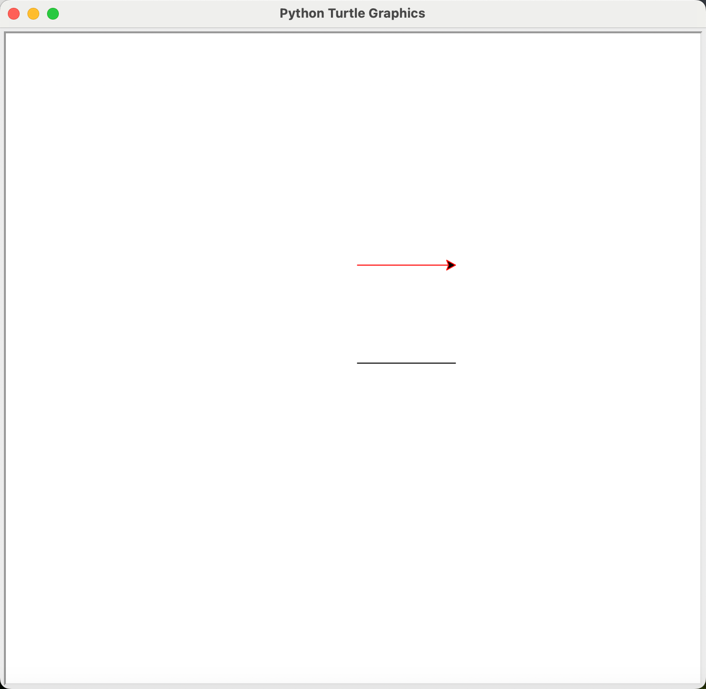
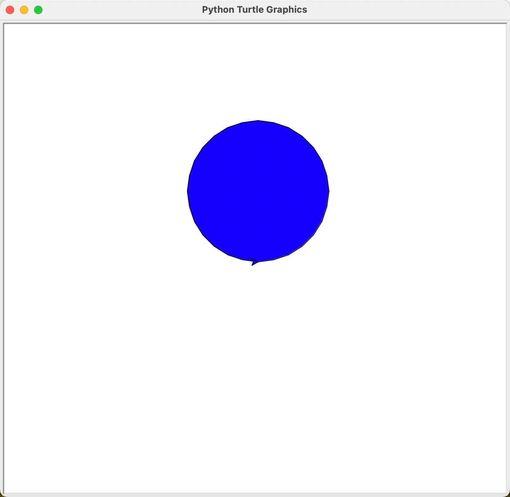
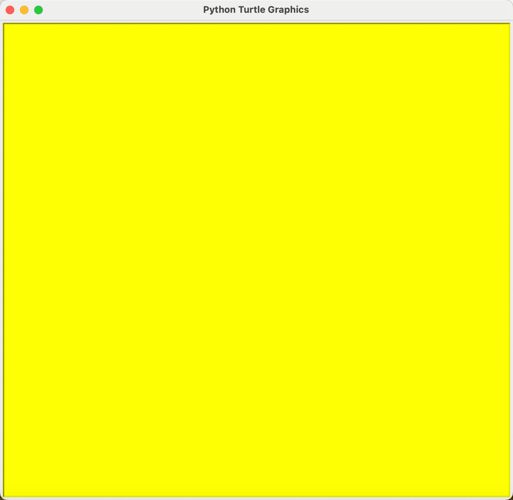
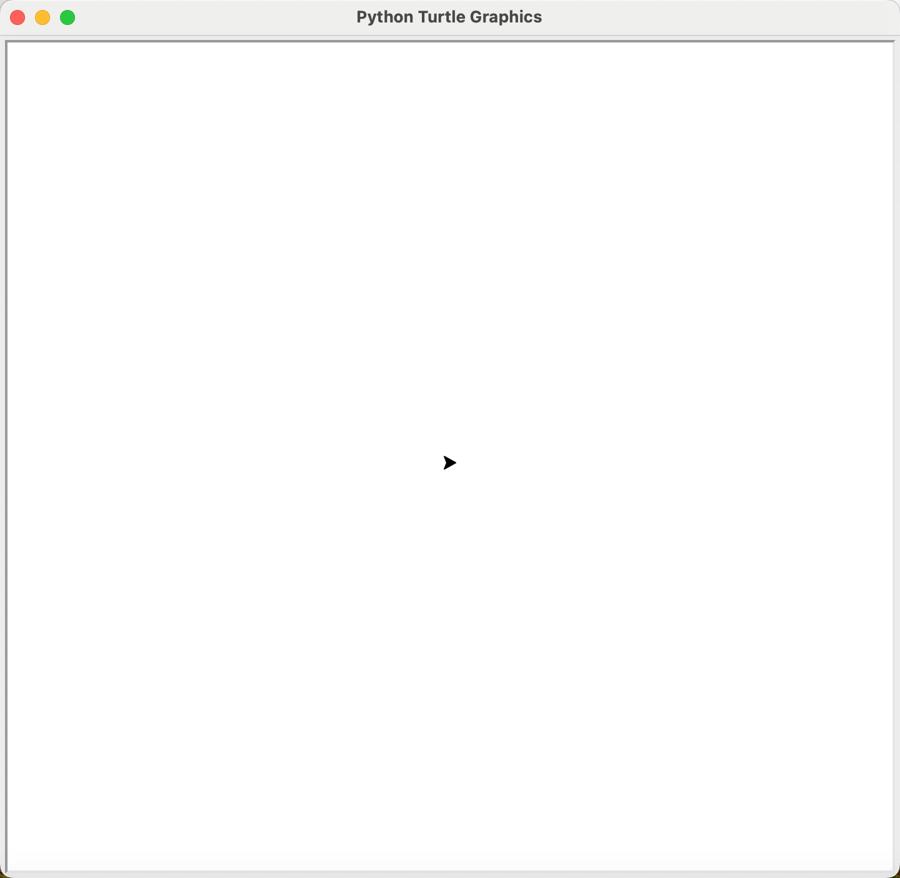

# 海龟画图-第二部分

## 让海龟去画图(二)

### 让海龟涂上颜色

#### 改变画笔的颜色

画笔的默认颜色为黑色，可以调用`pencolor()`改变画笔的颜色，这个函数的参数有很多格式，我们先只学习最简单的格式，即传入有实际颜色涵义的英文字符串，如：

```text
"red" "green" "yellow" "blue" "orange" "grey" "cyan" "white" "brown" "black"...
```

```python
import turtle as t
t.forward(100)
t.pu()
t.goto(0, 100)
t.pencolor("red")
t.pd()
t.forward(100)
```

<div align="center">

</div>

我们让海龟先移动了`100px`，然后抬笔将海龟移动到坐标`(0, 100)`的位置，改变画笔的颜色为`red`，再让海龟向前移动了`100px`，画出红色的线。

#### 填充颜色

在海龟画出一个平面图形之后，可以给这个图形填充颜色，需要调用下面两个函数来实现：

- `begin_fill()`表示开始填充，需要在要填充的形状之前调用，无参数。
- `end_fill()`表示结束填充，在`turtle`模块中，这个函数才是实际用来填充的函数，也无参数。

能够被填充的图形是由写在上述两个函数之间的代码所绘制的。

填充的颜色默认为黑色，需要改变填充颜色时，可以调用`fillcolor()`实现，所需传入的参数同`pencolor()`。

强调一下，被填充的是什么颜色只与在`end_fill()`函数之前最后一次调用`fillcolor()`所设置的颜色有关。

我们以下面代码为例:

```python
import turtle as t
t.fillcolor("red") # 设置填充颜色为red
t.begin_fill()
t.circle(100)
t.fillcolor("blue") # 设置填充颜色为blue，替换第一次设置的red
t.end_fill()
t.fillcolor("yellow") # 设置填充颜色为yellow，只对之后的填充生效，并不影响已经结束填充的图形
```

<div align="center">

</div>

#### 同时改变画笔和填充颜色

`color()`函数可以同时设置画笔和填充的颜色, 允许输入 0 至 3 个参数，这里我们只学习其中两种:

- `color("red","blue")` 设置画笔颜色为`red`，填充颜色为`blue`。
- `color("yellow")` 设置画笔与填充颜色均为`yellow`。

```python
import turtle as t
t.color("yellow")
```

#### 设置画布的颜色

海龟画图的画布为白色，如果想设置成其它颜色，可以调用`bgcolor()`实现，颜色参数的格式同`pencolor()`.

```python
import turtle as t
t.bgcolor("yellow")
```

<div align="center">

</div>


### 画笔与画在控制

#### 设置画布大小和位置

`setup()`函数可以设置主窗口的大小和位置，它有四个参数：

```Python
import turtle as t
t.setup(width=0.5, height=0.75, startx=None, starty=None)
```

- width -- 如为一个整型数值，表示大小为多少像素，如为一个浮点数值，则表示屏幕的占比；默认为屏幕的 50%
- height -- 如为一个整型数值，表示高度为多少像素，如为一个浮点数值，则表示屏幕的占比；默认为屏幕的 75%
- startx -- 如为正值，表示初始位置距离屏幕左边缘多少像素，负值表示距离右边缘，None 表示窗口水平居中
- starty -- 如为正值，表示初始位置距离屏幕上边缘多少像素，负值表示距离下边缘，None 表示窗口垂直居中

```Python
import turtle as t
t.setup(300, 300, 0, 0)
```


#### 设置海龟绘制速度

海龟模块中`speed()`函数可以设置绘制速度，这个函数只能接收`0~10`之间的整数，当传入`0`时，海龟的绘制速度是最快的，其次速度值从`1`到`10`，画线和海龟转向的动画效果逐级加快；如果输入数值大于`10`或小于`0.5`则速度设为`0`。 </br>
也可以传入速度字符串设置绘制速度，速度字符串与速度值的对应关系如下:

- "fastest": 0 最快
- "fast": 10 快
- "normal": 6 正常
- "slow": 3 慢
- "slowest": 1 最慢

```python
import turtle as t
t.speed(0)
t.speed("normal")
```

#### 设置画笔的粗细

画笔的默认为1px，调用`pensize()`函数可以设置画笔所画线条的粗细。

```Python
import turtle as t
t.forward(100)
```

<div align="center">

</div>

<!---->

```Python
import turtle as t
t.pensize(5)
t.pencolor("red")
t.forward(100)
```

<div align="center">

</div>

<!---->

#### 隐藏与显示画笔

在上面的学习过程中所示的图片中，可以看到海龟一直显示在画布上，可以调用`hideturtle()`使海龟不可见，隐藏之后在绘制复杂图形时可以显著加快绘制速度。

```python
import turtle as t
t.hideturtle() # 或 t.ht()
```

如果想重新让海龟显示在画布上，可以调用`showturtle()`:

```python
import turtle as t
t.showturtle() # 或 t.st()
```

#### 重置所有

`reset()`可以重置海龟的所有状态，并从画布中消除所有绘制的图形。

```python
import turtle as t
t.color("yellow")
t.seth(100)
t.goto(100, 100)
t.reset()
```

<div align="center">

</div>