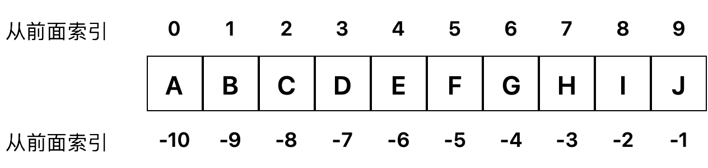

## 字符串

### 构造、创建

**直接创建**
```Python
str1 = "abcd"
```

也可以用**str(n)**函数将其它类型转换成字符串

```Python
str2 = str(1)
str2 = str([1,2,3,4])
```

我们在本章节学习字符串过程中，以下面的一个为例：

```Python
str1 = "ABCDEFGHIJ"
```

### 基本操作

字符串的基本操作主要有索引、切片、加、乘


#### 索引

可以把索引理解成每个字符在字符串中的位置，只是从前面索引时，索引值是从`0`开始，比如`A`在字符串`ABCDEFGHIJ`中的索引值为0， 从后面索引时，索引值从`-1`开始。



我们可以通过索引来访问字符串中的值：

```Python
>>> str1[0] #第一个元素
A
>>> str1[5] #第六个元素
F
>>> str1[-1] #倒数第一个元素
J
```

#### 切片

我们可以用`[]`运算符来对字符串进行切片，`[]`运算符中，有三个参数，每个参数用`:`隔开：

```Python
[start:end:steps]
```

- `start`是切片的起点，表示从哪个索引开始对字符串切片；
- `end`是切片的终点，表示切片到哪里结束，但是要注意的是这个索引是切不到的，只能切到它的前一个字符；
- `steps`表示步长，即切片时，要间隔几个字符来切。

str1[0:5] #第一个到第5个元素切片
str1[5:] #第六个到最后一个元素切片
str1[0:10:2] #从第一个到第十个元素，每隔一个切片
str1[9::-1] #从第十个到第一个倒着切片

# 删除
del str1

# 3. 函数和方法
#函数
len(str1) #有返回值，返回列表的长度
max(str1) #有返回值，返回列表中最大的元素，要求所有元素类型一致
min(str1) #有返回值，返回列表中最小的元素，要求所有元素类型一致
#方法
str1.capitalize() #有返回值，将字符串中第一个字符大写后返回
str1.count('ab') #有返回值，返回字符串str1中字符串'ab'的个数
str1.find('a') #有返回值，返回字符串str1中，字符中'a'第一次出现在索引，如果没有返回-1
str1.find('a', 2, 6) #有返回值，返回字符串str1中，字符中'a'在第2位和第6位之间第一次出现的索引，如果没有返回-1

str1.index('a') #有返回值，返回字符串str1中，字符中'a'第一次出现在索引，如果没有报错
str1.index('a', 2, 6) #有返回值，返回字符串str1中，字符中'a'在第2位和第6位之间第一次出现的索引，如果没有报错

str1.split(',') #无返回值，把'a'作为元素加入到list1中索引5的位置

list1.pop() #有返回值，删除列表中最后一个元素，并把这个元素返回
list1.pop(4) #有返回值，删除列表中索引为4的元素，并把这个元素返回

list1.reverse() #无返回值，把列表中元素索引从后往前重新排列，不以元素值的大小排列
#例如['b', 'c', 'd', 'a']，调用reverse之后变为['a','d','c','b']

list1.sort() #无返回值，把列表中元素按值的从小到大排列, 要求元素类型一致
list1.sort(reverse=True) #无返回值，把列表中元素按值的从大到小排列, 要求元素类型一致

list1.copy() #有返回值，复制当前列表并返回

# 4. 比较append和extend

# 5. 比较赋值与copy()

