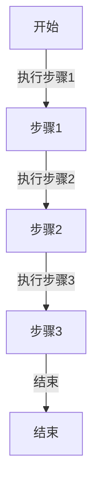

# 三大结构

编程语言中的三大语法结构通常是指顺序结构、选择结构和循环结构。这些结构是编写程序时用于组织和控制程序流程的基本构建块。

## 顺序结构(Sequential Structure)

顺序结构是程序中最简单、最基本的结构，它按照代码的书写顺序一条一条地执行，没有跳跃或分支。代码从上到下顺序执行，每一步都依赖于前一步的结果。

```python
statement1;
statement2;
statement3;
```




## 选择结构(Selection Structure)
选择结构根据条件的真假来决定程序执行的路径。常见的选择结构有if语句、switch语句等。通过选择结构，程序可以根据不同的条件执行不同的代码块。

```python
if condition:
    # code block executed if condition is true
else:
    # code block executed if condition is false
```

## 循环结构(Iteration Structure 或 Loop Structure)

循环结构用于重复执行一段代码，直到满足特定条件为止。循环结构有for循环和while循环等。循环结构可以有效地减少代码的冗余，提高代码的复用性和灵活性。

```python
for i in range(5):
    # code block executed 5 times

while condition:
    # code block executed as long as the condition is true
```

这三大语法结构是构建复杂程序的基石，通过它们的组合和嵌套，可以实现各种复杂的算法和逻辑。在不同的编程语言中，具体的语法细节可能会有所不同，但这三大结构的基本概念是通用的。