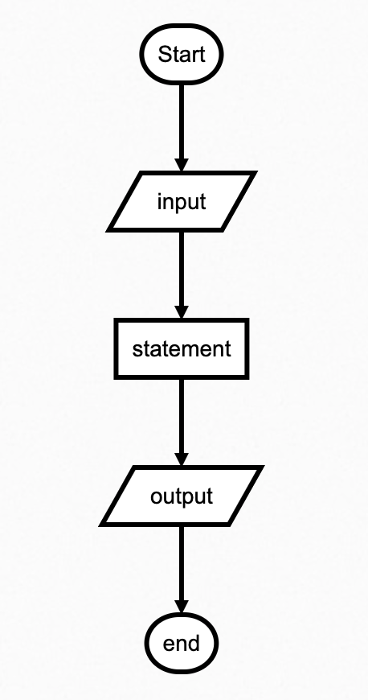
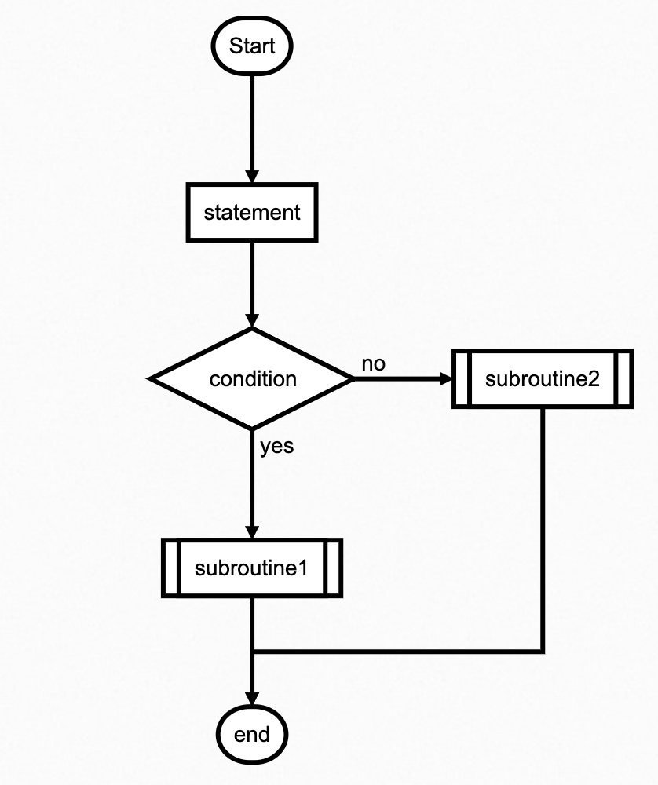
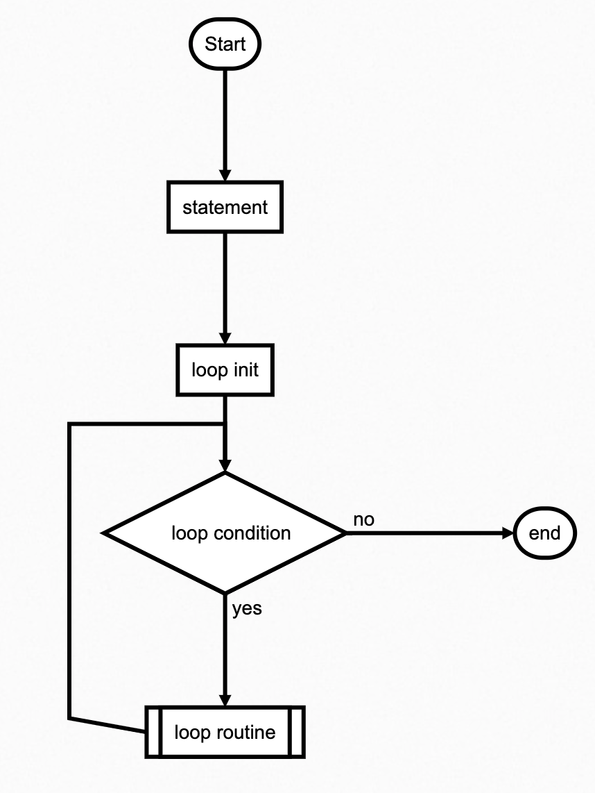

# 编程中的三大结构

Python是一种高级、通用、解释性的编程语言，它支持多种编程范式，包括过程式、面向对象和函数式编程。在Python中，程序的控制结构主要由三大基本结构构成：顺序结构、选择结构和循环结构。这三大结构为程序提供了基本的控制流程，使得程序能够按照特定的方式执行。在本文中，我们将深入探讨这三大结构的使用方法、示例和最佳实践。

## 顺序结构

顺序结构是程序执行的默认结构，代码按照从上到下的顺序执行，每一行代码都会被依次执行。在Python中，大多数代码都是按照顺序结构编写的。以下是一个简单的顺序结构的示例：

```python
print("这是第一行")
print("这是第二行")
print("这是第三行")
```

在这个例子中，代码会按照从上到下的顺序执行，依次输出每一行的内容。顺序结构是程序的基础，是编写代码的最简单形式。

下图为顺序结构的流程图

<div align="center">

</div>

## 选择结构（if 语句）

选择结构也叫分支结构，允许程序根据条件的真假选择性地执行不同的代码块。在Python中，使用`if`语句来实现选择结构。基本的`if`语句结构如下：

```python
if 条件:
    # 如果条件为真，执行这里的代码块
else:
    # 如果条件为假，执行这里的代码块
```

`elif`（else if的缩写）关键字可以用于处理多个条件的情况：

```python
if 条件1:
    # 如果条件1为真，执行这里的代码块
elif 条件2:
    # 如果条件1为假，但条件2为真，执行这里的代码块
else:
    # 如果所有条件都为假，执行这里的代码块
```

选择结构使得程序能够根据不同的条件执行不同的代码路径，实现分支逻辑。

<div align="center">

</div>

### 示例演示：

考虑一个简单的示例，根据用户的年龄判断其所属的年龄段：

```python
user_age = int(input("请输入您的年龄："))

if user_age < 0:
    print("年龄不能为负数")
elif 0 <= user_age < 18:
    print("您是未成年人")
elif 18 <= user_age < 65:
    print("您是成年人")
else:
    print("您是老年人")
```

在这个例子中，通过`if`语句判断用户所属的年龄段并输出相应的信息。

## 循环结构

循环结构允许程序重复执行特定的代码块，直到满足退出条件。Python中主要有两种循环结构：`for`循环和`while`循环。

<div align="center">

</div>

### for 循环

`for`循环用于遍历可迭代对象，每次迭代执行相同的代码块。基本语法如下：

```python
for 变量 in 可迭代对象:
    # 执行这里的代码块
```

例如，遍历一个列表：

```python
fruits = ["苹果", "香蕉", "橙子"]
for fruit in fruits:
    print(fruit)
```

`for`循环会依次将列表中的元素赋值给`fruit`变量，并执行相应的代码块。这种循环适用于已知迭代次数的情况。

### while 循环

`while`循环用于在条件为真的情况下重复执行代码块，直到条件变为假。基本语法如下：

```python
while 条件:
    # 执行这里的代码块
```

例如，计算一个数的阶乘：

```python
number = 5
factorial = 1

while number > 0:
    factorial *= number
    number -= 1

print("5的阶乘是:", factorial)
```

`while`循环会在每次迭代前检查条件，只有在条件为真时才执行循环体。这种循环适用于未知迭代次数的情况。

### 示例演示：

考虑一个简单的示例，使用`while`循环输出斐波那契数

列的前十个数字：

```python
a, b = 0, 1
count = 0

while count < 10:
    print(a, end=" ")
    a, b = b, a + b
    count += 1
```

在这个例子中，使用`while`循环输出斐波那契数列的前十个数字，直到`count`达到10为止。

## 结构的嵌套和组合

在实际的程序中，三大结构通常会被灵活地嵌套和组合使用，以满足更复杂的逻辑需求。例如，可以在循环结构中嵌套选择结构，或者在选择结构中嵌套循环结构，以实现更丰富的功能。

### 示例演示：

考虑一个简单的示例，使用嵌套结构判断一个数是否为质数：

```python
num = int(input("请输入一个整数："))

if num > 1:
    for i in range(2, int(num/2)+1):
        if (num % i) == 0:
            print(num, "不是质数")
            break
    else:
        print(num, "是质数")
else:
    print(num, "不是质数")
```

通过嵌套使用`if`语句和`for`循环，判断用户输入的整数是否为质数。

## 总结与最佳实践

- **清晰的代码结构：** 为了提高代码的可读性，建议使用适当的缩进和空格，使代码结构清晰。
- **合理使用注释：** 对于复杂的逻辑或特殊情况，使用注释来解释代码的意图，提高代码的可维护性。
- **谨慎使用嵌套：** 避免过度嵌套，以保持代码的简洁和可读性。过深的嵌套结构可能会导致代码难以理解和维护。
- **利用函数封装逻辑：** 对于重复使用的逻辑，考虑将其封装成函数，提高代码的模块化和复用性。
- **灵活使用三大结构：** 根据具体问题的需求，灵活使用顺序结构、选择结构和循环结构，构建清晰且高效的程序。

通过深入理解和熟练运用顺序结构、选择结构和循环结构，程序员能够更加灵活地设计和实现各种算法和应用，使得代码具有更好的可读性、可维护性和可扩展性。这三大结构为Python程序提供了强大的控制能力，使得开发者能够应对不同的编程场景，创造出高效且功能强大的应用程序。