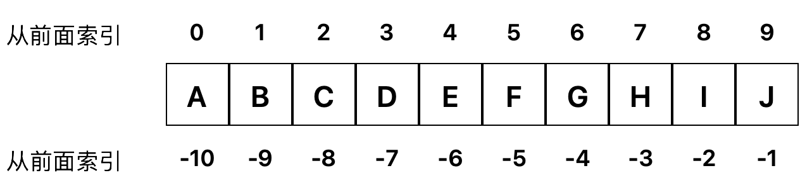

# 字符串

字符串或串`(string)`是由数字、字母、各种特殊字符组成的一串字符。一般记为 `s="a1a2···an"(n>=0)`。它是编程语言中表示文本的数据类型。在程序设计中，字符串为符号或数值的一个连续序列，如符号串（一串字符）或二进制数字串（一串二进制数字）。

`Python`中的字符串是一种非常重要且灵活的数据类型，它用于表示文本信息，并且在`Python`编程中被广泛使用。字符串在`Python`中被视为不可变的序列，这意味着一旦创建了字符串，就不能再对其进行修改。

### 字符串的基本特性
- **不可变性:** 字符串一旦创建，就不能被修改。可以创建新的字符串来实现修改的效果。

- **序列性:** 字符串是一个由字符组成的序列，可以通过索引和切片来访问字符串中的字符或子串。

- **Unicode支持:** `Python`的字符串是`Unicode`字符串，支持多种语言的字符集，因此可以处理各种语言的文本。

### 字符串的编码
字符串的编码是将字符转换为字节序列的过程，Python 中常用的编码方式包括 ASCII、UTF-8、UTF-16 等。在 Python 中，字符串默认使用 Unicode 编码。

- **`ASCII` 编码:** 最早的字符编码方式，只能表示英文字母、数字和一些特殊字符，使用`7`位字节表示一个字符。

- **`UTF-8` 编码:** `Unicode`的一种实现方式，是一种变长编码，能够表示全球范围内的字符集，并且节省存储空间。

- **`UTF-16` 编码:** `Unicode`的另一种实现方式，使用`16`位字节表示一个字符，适用于需要大量使用非`ASCII`字符的情况。

在`Python`中，你可以使用`encode()`方法将字符串编码为字节序列，使用`decode()`方法将字节序列解码为字符串。

## 构造字符串

在Python中，以引号包围的内容均可认为是字符串：

```python
>>> s = "jfdlasjlfewoi23u8ro23uokl"
>>> s1 = 'r32oodsalhf8oweohesalhfla'
>>> s2 = '''abcdefg
hijklmn
'''
```

## 索引和切片

### 索引
可以把索引理解成每个字符在字符串中的位置，只是从前面索引时，索引值是从`0`开始，比如`a`在字符串`abcdefgh`中的索引值为0， 从后面索引时，索引值从`-1`开始，索引的操作符为`[]`。



```python
>>> s = 'abcdefgh'
>>> s[0]
'a'
```

### 切片

在`Python`中，切片`（slice）`是一种从序列（如列表、元组、字符串等）中获取子序列的方法。切片允许你通过指定起始索引、终止索引和步长来选择序列中的一部分元素，并将它们返回为一个新的序列。

切片的语法为

```python
sequence[start:stop:step]
```

在执行切片时，`Python`遵循的是数学里区间的左闭右开原则，即`[start, stop)`, 也就是说`stop`索引位置的元素是取不到的。

- `start`为切片的起始索引，即从哪个索引开始切片;
- `stop`为切片的终止索引，但是切不到这个索引位置，只到它之前结束;
- `step`为步长，即切片时间隔多少个元素，默认为`1`。

正向切片时，`stop`的值要大于`start`的值，并且步长`step`要必须为正数，否则切片结果为一个空列表`[]`。

```python
>>> s = "abcdefghijklmn"
>>> s[1:4] 
'bcd'
>>> s[0:9:2]
'acegi'
```

反向切片时，`stop`的值要小于`start`的值，并且步长`step`要必须为负数，否则切片结果为一个空列表`[]`。

```python
>>> s = "abcdefghijklmn"
>>> s[-3:-9:-1]
'lkjihg'
```

`start`和`stop`也可以省略不写。

```python
>>> s = "abcdefghijklmn"
>>> s[:8:]
'abcdefg'
>>> s[8:]
'hijklmn'
>>> s[::-1]
'nmlkjihgfedcba'
```

## 删除字符串
Python中只能完全删除字符串。
```python
>>> del s
>>> print(s)
Traceback (most recent call last):
  File "<pyshell#0>", line 1, in <module>
    print(s)
NameError: name 's' is not defined
```

## 格式化

- **`%`格式化**，使用`%`运算符和格式化字符来格式化字符串。

```python
>>> name = "Alice"
>>>> age = 30
>>> result = "My name is %s and I am %d years old." % (name, age)
My name is Alice and I am 30 years old.
```

- **`str.format()`**,是用来格式化字符串里的内容的方法。

```python
>>> "My name is {}, I am {}.".format("Chris",36)
'My name is Chris, I am 36.'
>>> "I have {0} pens, all are {1}".format(10, "black")
'I have 10 pens, all are black'
>>> "I have {1} pens, all are {0}".format(10, "black")
'I have black pens, all are 10'
>>> "I am living in {city}, but I was born in {addr}".format("Shanghai", "Jiangsu")
Traceback (most recent call last):
  File "<pyshell#50>", line 1, in <module>
    "I am living in {city}, but I was born in {addr}".format("Shanghai", "Jiangsu")
KeyError: 'city'
>>> "I am living in {city}, but I was born in {addr}".format(city="Shanghai", addr="Jiangsu")
'I am living in Shanghai, but I was born in Jiangsu'
```

- **`f-string`**, 使用`f-string`来格式化字符串。

```python
>>> name = "Charlie"
>>> age = 20
>>> result = f"My name is {name} and I am {age} years old."
My name is Charlie and I am 20 years old.
```

## 遍历字符串

用`for`循环可以对那些可迭代的对象进行遍历，主要有两种方式：

### 索引遍历

```Python
s = "abcdefg"

for j in range(len(s)):
    print(s[j])

for i in s:
    print(i)
```
这种方式通过索引来访问字符串中的元素。`j` 在每次循环中都被赋值为字符串的下一个索引，然后使用这个索引来从字符串中获取元素。

### 直接遍历

```Python
s = "ABCDEFG"

for i in s:
    print(i)
```
这种方式直接遍历字符串中的每一个元素。`i` 在每次循环中都会被赋值为字符串 `s` 的下一个元素。这种方式效率比索引遍历要高。

## 函数

在学习函数之前，首先要对函数有一个初步的认识。首先要知道的是`Python`中函数都是独立的代码块，可以重复调用，用来执行特定的任务或实现特定的功能。我们可以将函数比作一口做饭的大锅`cooker`，它可以用来炖母鸡`hen`，需要通过函数名和参数列表来调用：

```python
>>> cooker(hen)
"Chicken Soup"
```
以下为列表中的三个函数为字符串中经常会使用的函数。

| 名字    | 说明               |
|:------|:-----------------|
| `len` | 有返回值，返回字符串的长度    |
| `min` | 有返回值，返回字符串中最小的字符 |
| `max` | 有返回值，返回字符串中最大的字符 |

### len(string)

`len`返回字符串`string`的长度，即元素的个数。

```python
>>> len("abcdefg")
7
```

### max(string)/min(string)

`max`和`min`分别返回`string`的中最大和最小的元素，元素的大小以字符在字符集中的位置来判定。

```python
>>> max("ABCDEFG")
'G'
>>> min("abCDEFG")
'C'
```

## 方法

在`Python`中，方法是要关联在对象中的，需要在一个类的内部定义，去操作对象的属性或者执行对象的特定的功能，所谓的对象可以理解成一个实际的事物，如一只母鸡（母鸡属于鸡这一类）。在这一例子中，母鸡有很多的方法，比如下蛋。

在调用方法时，需要通过对象名和方法名进行，并要传入方法的参数:

```python
>>> hen = Chicken()
>>> hen.dropegg(2)
'The hen dropped 2 eggs.'
```

对于`Python`中所有的内置数据类型，我们在创建时，它们都自动被标识成它所属类型的实例对象：

- `1`是`int`整型类型的实例对象
- `'hello'`是`str`字符串类型的实例对象
- `[1,2,3]`是`list`列表类型的实例对象
- ......

将这些实际的值赋值给一个变量之后，上述说法也成立。所以我们不需要通过`hen = Chicken()`这样的方式创建这些类型。这个内容将会在学习面向对象时详细介绍。

在调用这些实例的方法时，可以直接通过值来调用，也可以在赋值给变量后，通过变量来调用：

```python
>>> "hello".upper()
'HELLO'
>>> s = "WORLD"
>>> s.lower()
'world'
```

下面我们将对字符串中常用的方法进行学习。

### 查找与替换

| 方法              | 说明              |
|:----------------|:----------------|
| `count`         | 统计子串在字符串中出现的次数  |
| `find`、`index`  | 查找子串在字符串中的位置    |
| `replace`       | 替换字符串中的子串       |

#### count(sub[, start[, end]])

`count`函数可以查找在`[start:end]`切片之间，子串`sub`出现的次数，如果未指定范围则在整个字符串范围内查找。

```python
>>> s = "My name is Chris, I am 6 years old, I will go to Primary School this September."
>>> s.count('I')
2
```

#### find(sub[, start[, end]]) / index(sub[, start[, end]])

- `find`返回子字符串`sub`在 `[start:end]` 切片内被找到的最小索引。 如果`sub`未被找到则返回`-1`。
- `index`返回子字符串`sub`在 `[start:end]` 切片内被找到的最小索引。 如果`sub`未被找到则会报错`ValueError`。

```python
>>> s = "to be or not to be, that is a question."
>>> s.find("to")
0
>>> s.index("to", 3, 20)
13
>>> s.find("I")
-1
>>> s.index("I")
Traceback (most recent call last):
  File "<pyshell#4>", line 1, in <module>
    s.index("I")
ValueError: substring not found
```

#### replace(old, new[, count])

`replace`返回字符串的副本，其中出现的所有子字符串`old`都将被替换为`new`。 如果给出了可选参数`count`，则只替换前`count`次出现；并不会改变原来的字符串。

```python
>>> s = "My name is Chris."
>>> s.replace("Chris", "Eris")
'My name is Eris.'
>>> print(s)
'My name is Chris.'
```

### 分割和连接

| 方法      | 说明             |
|:--------|:---------------|
| `split` | 将字符串分割成子串列表    |
| `join`  | 连接字符串列表成为一个字符串 |

#### split(sep)

`split`使用`sep`作为分隔字符串，返回一个由字符串内单词组成的列表。

```python
>>> '1,2,3'.split(',')
['1', '2', '3']
>>> '1,2,3'.split(',', maxsplit=1)
['1', '2,3']
>>> '1,2,,3,'.split(',')
['1', '2', '', '3', '']
>>> '1<>2<>3'.split('<>') 
['1', '2', '3']
```

#### join(iterable)

`join`返回一个由`iterable`中的字符串拼接而成的字符串，`iterable`可以为任何高级数据类型，如列表、元组等。

```python
>>> '-'.join(['a', 'b', 'c'])
'a-b-c'
>>> ','.join("abcdefg")
'a,b,c,d,e,f,g'
```

### 大小写转换

| 方法      | 说明              |
|:--------|:----------------|
| `lower` | 将字符串中的字符全部转换成小写 |
| `upper` | 将字符串中的字符全部转换成大写 |

```python
>>> s = 'hello world'
>>> print(s.upper())  
'HELLO WORLD'
>>> print(s.lower())  
'hello world'
```

### 去除左右的子串


| 方法                | 说明            |
|:------------------|:--------------|
| `strip`           | 去除字符串两端的子串    |
| `lstrip`、`rstrip` | 去除字符串左侧或右侧的子串 |

#### strip(chars)

`strip`将去除字符串中左右两端的所有的子串，这个子串为所有由`chars`中指定字符的组合，并返回去除后字符串的副本。如果未指定`sub`，则默认去除左右两端的空格；不会改变原来的字符串值。

```python
>>> "   good    ".strip()
'good'
>>> website = 'www.google.com'
>>> website.strip('cowm.')
'google'
>>> print(website)
www.google.com
>>> comment_string = '#....... Section 3.2.1 Issue #32 .......'
>>> comment_string.strip('.#! ')
'Section 3.2.1 Issue #32'
```

### 其他常用方法

| 方法           | 说明              |
|:-------------|:----------------|
| `startswith` | 判断字符串是否以指定前缀开始  |
| `endswith`   | 判断字符串是否以指定后缀结束  |
| `isalpha`    | 判断字符串是否只包含字母    |
| `isdigit`    | 判断字符串是否只包含数字    |
| `isalnum`    | 判断字符串是否只包含字母或数字 |
| `isspace`    | 判断字符串是否只包含空白字符  |

```python
>>> s = 'hello world'
>>> print(s.startswith('hello'))  # 输出: True
>>> print(s.endswith('world'))  # 输出: True
>>> print(s.isalpha())  # 输出: False
>>> print(s.isdigit())  # 输出: False
>>> print(s.isalnum())  # 输出: False
>>> print(s.isspace())  # 输出: False
```


