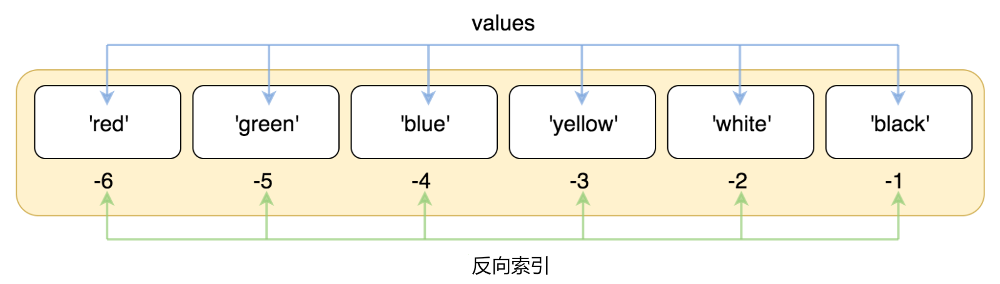

## 列表 List

列表是Python最常见的序列，它的结构和字符串很接近，但不完全一样。

### 基本操作

#### 创建列表

列表内的元素没有类型的限制，任何一个类型的数据都可以作为元素存放在列表里。
如：

```Python
lst = [1,2,3,4,5]
strls = ['a','b','c']
mixls = [1, 2, 109, 10.3, 'Chris', [4,5,6]]
```

#### 索引

与字符串一样，列表也可以从正反两个方向来索引

比如：

```Python
lst = ['red', 'green', 'blue', 'yellow', 'white', 'black']
```

正向索引：


反向索引:


```python
>>> print(lst[0])
red
>>> print(lst[10])
Traceback (most recent call last):
  File "<pyshell#3>", line 1, in <module>
    print(lst[10])
IndexError: list index out of range
>>> print(lst[-2])
white
```

#### 切片

与字符串一样，列表也可以进行切片，用的切片运算符也是`[]`
它的语法为：
```shell
list_name[start:end:step]
```
需要注意的是：
- `start`为切片的起始索引，即从哪个索引开始切片;
- `end`为切片的结束索引，但是切不到这个索引位置，只到它之前结束;
- `step`为步长，即切片时间隔多少个元素。

```Python
numlst = [1,2,3,4,5,6,7,8,9,10]
numlst[1:4] #结果为[2,3,4]
numlst[6:] #切片从索引6开始，切到最后，即[7,8,9,10]
numlst[::2] #[1,3,5,7,9]
```
通常情况下，切片时，`end`的值要大于`start`的值，否则切片结果为一个空列表`[]`。
但也有例外，如果设置了步长为负数，那么`end`的值一定要小于`start`的值，如：
```Python
numlst[5:2:-1]
```

**列表的切片结果还是列表**

#### 修改列表

可以通过索引和切片来修改列表的元素值：

```Python
numlst = [1,2,3,4,5,6,7,8,9,10]
numlst[0] = 100
print(numlst)
"""
结果为[100,2,3,4,5,6,7,8,9,10]
"""
numlst[1:4] = ['a','b']
print(numlst)
"""
结果为[100,'a','b',5,6,7,8,9,10]
"""
```
这里提到的修改只是修改这个列表里的内容，不会改变列表的对象。

#### 删除列表里的值

与字符串不同的是，我们可以调用`del`关键字来删除列表里的元素，或者一段切片。

```Python
numlst = [1,2,3,4,5,6,7,8,9,10]
del numlst[0]
print(numlst)
"""
结果为[2,3,4,5,6,7,8,9,10]
"""
del numlst[1:4]
print(numlst)
"""
结果为[1,5,6,7,8,9,10]
"""
del numlst #删除整个列表
```

#### 列表的加法运算

列表的加法运算只能发生在两个列表之间，不能与其它类型进行加法运算。

```Python
lst1 = [1,2,3]
lst2 = [4,5,6]
print(lst1 + lst2)
"""
结果为[1,2,3,4,5,6]
"""
lst3 = lst1 + lst2
```

#### 列表的乘法运算

列表的加法运算只能发生在列表和整型之间，不能与其它类型进行乘法运算。

```Python
lst1 = [1,2,3]
print(lst1 * 2)
"""
结果为[1,2,3,1,2,3]
"""
lst3 = lst1 * 2
```

### 遍历列表

用`for`循环可以对那些可迭代的对象进行遍历

```Python
lst = [1,2,3,4,5,6,7,8,9,10]

for i in lst:
    print(i)

for j in range(len(lst)):
    print(lst[j])
```

### 函数

| 名字     | 说明                                  |
|:-------|:------------------------------------|
| `len`  | 有返回值，返回字符串的长度                       |
| `min`  | 有返回值，返回字符串中最小的字符                    |
| `max`  | 有返回值，返回字符串中最大的字符                    |
| `list` | 有返回值，返回一个列表，输入的参数必须为一个序列，将这个序列转换为列表 |


### 方法

#### count()

`list.count(v)` 返回在`list`中有几个`v`

```python
>>> lst = [2,3,4,65,1,34,5,2,5,7,10]
>>> lst.count(5)
2
```


#### append() 与 extend()

`list.append(v)`，这个方法无返回值，其作用为将`v`做为一个元素，插入到列表的最后一位。

```python
>>> lst = [1,2,3,4,5]
>>> lst.append('a')
>>> print(lst)
[1,2,3,4,5,'a']
>>> lst.append([7,8,9])
>>> print(lst)
[1,2,3,4,5,'a',[7,8,9]]
```

`list.extend(seq)`，这个方法也无返回值，要求输入的参数必须为一个序列，它的作用为将`seq`中的所有元素，都单独作为一个元素按顺序插入到列表的后面。

```python
>>> lst = [1,2,3,4,5]
>>> lst.extend('abc')
>>> print(lst)
[1,2,3,4,5,'a','b','c']
>>> lst.extend(1)
Traceback (most recent call last):
  File "<pyshell#1>", line 1, in <module>
    lst.extend(1)
TypeError: 'int' object is not iterable
```

#### index()

列表的`index(v,start, end)`方法有三个参数，其中后面两个是可以省略的。
其作用为返回`v`在整个列表或给定范围内第一次出现的索引，如果不存在则报错。

```python
>>> lst = [1, 2, 3, 4, 5, 'a', 'b', 'c']
>>> lst.index(2)
1
>>> lst.index(2,1,5)
1
>>> lst.index(2,2,5)
Traceback (most recent call last):
  File "<pyshell#6>", line 1, in <module>
    lst.index(2,2,5)
ValueError: 2 is not in list
>>> lst.index('a',2,5)
Traceback (most recent call last):
  File "<pyshell#7>", line 1, in <module>
    lst.index('a',2,5)
ValueError: 'a' is not in list
>>> lst.index(5,2,5)
4
>>> lst.index(2,2)
Traceback (most recent call last):
  File "<pyshell#9>", line 1, in <module>
    lst.index(2,2)
ValueError: 2 is not in list
>>> lst.index(2,1)
1
```

#### insert()

`list.insert(index, v)`无返回值，它会将值`v`插入到列表的索引位置`index`上。

```python
>>> lst.insert(2,6)
>>> lst
[1, 2, 6, 3, 4, 5, 'a', 'b', 'c']
>>> lst.insert(9,7)
>>> lst
[1, 2, 6, 3, 4, 5, 'a', 'b', 'c', 7]
>>> lst.insert(100, 8)
>>> lst
[1, 2, 6, 3, 4, 5, 'a', 'b', 'c', 7, 8]
```

#### pop()

`list.pop(index)`，如果给定`index`一个索引值，则移除列表中这个索引下的元素，如未给定则移除最后一个元素，最后将这个被移除的元素返回。

```python
>>> lst.pop()
8
>>> lst
[1, 2, 6, 3, 4, 5, 'a', 'b', 'c', 7]
>>> lst.pop(2)
6
>>> lst
[1, 2, 3, 4, 5, 'a', 'b', 'c', 7]
```

#### remove()

`list.remove(v)`无返回值，其作用为移除掉第一个值为`v`的元素。、

```python
>>> lst = [1,2,3,4,5,2,7]
>>> lst.remove(2)
>>> print(lst)
[1,3,4,5,2,7]
```

#### reverse()

`list.reverse()`将列表中元素按索引的位置倒序排列。

```python
>>> lst = [5,7,2,3,6,10]
>>> lst.reverse()
>>> print(lst)
[10, 6, 3, 2, 7, 5]
```

#### sort()

`list.sort()`对原列表的元素进行排序，将列表生成一个新的有序的列表。
参数`reverse`被传入的值为`True`，则倒序排列。否则正序排列。

```python
>>> lst = [5,7,2,3,6,10]
>>> lst.sort()
>>> print(lst)
[2,3,5,6,7,10]
>>> lst = [5,7,2,3,6,10]
>>> lst.sort(reverse=True)
>>> print(lst)
[10,7,6,5,3,2]
```

#### clear()

`list.clear()`清空列表，将其变成一个空列表`[]`

#### copy()

`list.copy()`将列表复制一份之后再返回新复制的列表，这里的复制是值复制。
将列表直接赋值给一个变量为引用复制。

```python
>>> lst = [1,2,3,4,5]
>>> lst1 = lst.copy()
>>> lst2 = lst
>>> lst1.append(6)
>>> print(lst1)
[1,2,3,4,5,6]
>>> print(lst)
[1,2,3,4,5]
>>> lst2.append(6)
>>> print(lst)
[1, 2, 3, 4, 5, 6]
```
