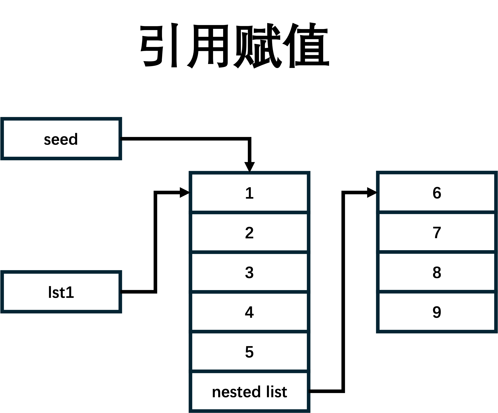

# 列表 List

`Python`中的列表`List`是一种非常重要和常用的数据结构，它允许我们存储和操作多个元素。在`Python`中，列表是一种有序的序列，可以包含任意数量的元素，并且可以动态地改变大小。列表是`Python`中最灵活、最常用的数据类型之一，几乎在每个`Python`程序中都会被广泛应用。

## 基本操作

### 创建列表

在`Python`中，可以通过简单的方括号`[]`来创建一个列表，并在其中放入多个元素，元素之间用逗号`,`分隔。例如：

```python
>>> my_list = [1, 2, 3, 4, 5]
```

上述代码创建了一个名为`my_list`的列表，其中包含了整数`1`到`5`。列表中的元素可以是任意类型的对象，也可以是不同类型的对象的组合，甚至可以是另一个列表。例如：

```python
>>> mixed_list = [1, 'apple', True, [5, 6, 7]]
```
这个列表中包含了一个整数、一个字符串、一个布尔值和一个内嵌列表。`Python`的列表是可以嵌套的，也就是说一个列表可以包含另一个列表作为其元素。

### 索引

与字符串一样，列表也可以从正反两个方向来索引

比如：

```Python
lst = ['red', 'green', 'blue', 'yellow', 'white', 'black']
```

正向索引：


反向索引:


```python
>>> print(lst[0])
red
>>> print(lst[-2])
white
```

同样列表也不能越界访问其中的元素：

```python
>>> print(lst[10])
Traceback (most recent call last):
  File "<pyshell#3>", line 1, in <module>
    print(lst[10])
IndexError: list index out of range
```

### 切片

与字符串一样，列表也可以进行切片，所用的运算符也是`[]`, 它的语法与字符串类似：

```python
list_name[start:stop:step]

```python
>>> numlst = [1,2,3,4,5,6,7,8,9,10]
>>> numlst[1:4] 
[2,3,4]
>>> numlst[6:] #切片从索引6开始，切到最后
[7,8,9,10]
>>> numlst[::2] 
[1,3,5,7,9]
```

**列表的切片结果还是列表**

通常情况下，切片时，`stop`的值要大于`start`的值，否则切片结果为一个空列表`[]`。
但也有例外，如果设置了步长`step`为负数，那么`stop`的值一定要小于`start`的值，如：

```python
>>> numlst[5:2:-1]
[6, 5, 4]
```

### 修改列表

可以通过索引和切片来修改列表的元素值：

```python
>>> numlst = [1,2,3,4,5,6,7,8,9,10]
>>> numlst[0] = 100
>>> print(numlst)
[100,2,3,4,5,6,7,8,9,10]
>>> numlst[1:4] = ['a','b']
>>> print(numlst)
[100,'a','b',5,6,7,8,9,10]
```
这里提到的修改只是修改这个列表里的内容，不会改变列表的对象。

### 删除列表里的值

与字符串不同的是，我们可以调用`del`关键字来删除列表里的元素，或者一段切片。

```python
>>> numlst = [1,2,3,4,5,6,7,8,9,10]
>>> del numlst[0]
>>> print(numlst)
[2,3,4,5,6,7,8,9,10]
>>> del numlst[1:4]
>>> print(numlst)
[1,5,6,7,8,9,10]
>>> del numlst #删除整个列表
```

### 列表的加法运算

列表的加法运算只能发生在两个列表之间，不能与其它类型进行加法运算。

```python
>>> lst1 = [1,2,3]
>>> lst2 = [4,5,6]
>>> print(lst1 + lst2)
[1,2,3,4,5,6]
>>> lst3 = lst1 + lst2
```

### 列表的乘法运算

列表的加法运算只能发生在列表和整型之间，不能与其它类型进行乘法运算。

```python
>>> lst1 = [1,2,3]
>>> print(lst1 * 2)
[1,2,3,1,2,3]
>>> lst3 = lst1 * 2
```

## 遍历列表

用`for`循环可以对那些可迭代的对象进行遍历，主要有两种方式：

### 索引遍历

```Python
lst = [1,2,3,4,5,6,7,8,9,10]

for j in range(len(lst)):
    print(lst[j])
```
这种方式通过索引来访问列表中的元素。`j` 在每次循环中都被赋值为列表的下一个索引，然后使用这个索引来从列表中获取元素。这种方式在处理简单元素（如整数或字符串）的列表时，由于需要额外的索引查找，可能会比第一种方式稍慢一些。

### 直接遍历

```Python
lst = [1,2,3,4,5,6,7,8,9,10]

for i in lst:
    print(i)
```
这种方式直接遍历列表中的每一个元素。`i` 在每次循环中都会被赋值为列表 `lst` 的下一个元素。这种方式更简洁，并且当列表的元素是复杂对象（如字典或自定义类的实例）时，效率更高。

## 函数

| 名字     | 说明                                  |
|:-------|:------------------------------------|
| `len`  | 有返回值，返回字符串的长度                       |
| `min`  | 有返回值，返回字符串中最小的字符                    |
| `max`  | 有返回值，返回字符串中最大的字符                    |


## 方法

### 内容查找

| 方法      | 说明              |
|:--------|:----------------|
| `count` | 统计在列表中某个元素出现的次数 |
| `index` | 查找在列表中某个元素的位置   |

#### count(value)

`count` 返回在列表中有几个`value`

```python
>>> lst = [2,3,4,65,1,34,5,2,5,7,10]
>>> lst.count(5)
2
```

#### index(value, start=0, stop)

列表的`index(value,start, stop)`方法有三个参数，其中后面两个是可以省略的。
其作用为返回`value`在整个列表或给定范围内第一次出现的索引，如果不存在则报错。

```python
>>> lst = [1, 2, 3, 4, 5, 'a', 'b', 'c']
>>> lst.index(2)
1
>>> lst.index(2,1,5)
1
>>>
>>>
>>> lst.index(2,2,5)
Traceback (most recent call last):
  File "<pyshell#6>", line 1, in <module>
    lst.index(2,2,5)
ValueError: 2 is not in list
>>>
>>>
>>> lst.index('a',2,5)
Traceback (most recent call last):
  File "<pyshell#7>", line 1, in <module>
    lst.index('a',2,5)
ValueError: 'a' is not in list
>>> lst.index(5,2,5)
4
>>>
>>>
>>> lst.index(2,2)
Traceback (most recent call last):
  File "<pyshell#9>", line 1, in <module>
    lst.index(2,2)
ValueError: 2 is not in list
>>> lst.index(2,1)
1
```

### 扩展新的元素

| 方法       | 说明                     |
|:---------|:-----------------------|
| `append` | 将一个新的元素插入在列表的末尾        |
| `extend` | 将一个可迭代对象中的元素逐个插入到列表的末尾 |
| `insert` | 将一个元素插入到列表的指定位置        |

#### append(object) 与 extend(iterable)

`append`，这个方法无返回值，其作用为将`object`做为一个元素，插入到列表的最后一位。

```python
>>> lst = [1,2,3,4,5]
>>> lst.append('a')
>>> print(lst)
[1,2,3,4,5,'a']
>>> lst.append([7,8,9])
>>> print(lst)
[1,2,3,4,5,'a',[7,8,9]]
```

`extend`，这个方法也无返回值，要求输入的参数必须为一个序列，它的作用为将`iterable`中的所有元素，都单独作为一个元素按顺序插入到列表的后面。

```python
>>> lst = [1,2,3,4,5]
>>> lst.extend('abc')
>>> print(lst)
[1,2,3,4,5,'a','b','c']
>>> lst.extend(1)
Traceback (most recent call last):
  File "<pyshell#1>", line 1, in <module>
    lst.extend(1)
TypeError: 'int' object is not iterable
```

#### insert(index, object)

`insert`无返回值，它会将值`value`插入到列表的索引位置`index`上。

```python
>>> lst.insert(2,6)
>>> lst
[1, 2, 6, 3, 4, 5, 'a', 'b', 'c']
>>> lst.insert(9,7)
>>> lst
[1, 2, 6, 3, 4, 5, 'a', 'b', 'c', 7]
>>> lst.insert(100, 8)
>>> lst
[1, 2, 6, 3, 4, 5, 'a', 'b', 'c', 7, 8]
```

### 删除列表的元素

| 方法       | 说明                  |
|:---------|:--------------------|
| `pop`    | 删除列表中指定索引位置的元素      |
| `remove` | 删除列表中第一次出现值为指定内容的元素 |
| `clear`  | 清空整个列表              |

#### pop(index=-1)

`pop(index)`，如果给定`index`一个索引值，则移除列表中这个索引下的元素，如未给定则移除最后一个元素，最后将这个被移除的元素返回。

```python
>>> lst.pop()
8
>>> lst
[1, 2, 6, 3, 4, 5, 'a', 'b', 'c', 7]
>>> lst.pop(2)
6
>>> lst
[1, 2, 3, 4, 5, 'a', 'b', 'c', 7]
```

#### remove(value)

`remove`无返回值，其作用为移除掉第一个值为`value`的元素。

```python
>>> lst = [1,2,3,4,5,2,7]
>>> lst.remove(2)
>>> print(lst)
[1,3,4,5,2,7]
```

#### clear()

`clear`清空列表，将其变成一个空列表`[]`

```python
>>> lst = [1,2,3,4,5]
>>> lst.clear()
>>> print(lst)
[]
```

### 改变元素的排列


| 方法        | 说明                  |
|:----------|:--------------------|
| `sort`    | 将列表的元素按升序或降序排列      |
| `reverse` | 将列表的元素反序，但是并使列表元素有序 |

#### sort(reverse=False)

`sort`对原列表的元素进行排序，将列表生成一个新的有序的列表。 参数`reverse`被传入的值为`True`，则倒序排列；否则正序排列。

```python
>>> lst = [5,7,2,3,6,10]
>>> lst.sort()
>>> print(lst)
[2,3,5,6,7,10]
>>> lst = [5,7,2,3,6,10]
>>> lst.sort(reverse=True)
>>> print(lst)
[10,7,6,5,3,2]
```

#### reverse()

`reverse`将列表中元素按索引的位置反序排列。

```python
>>> lst = [5,7,2,3,6,10]
>>> lst.reverse()
>>> print(lst)
[10, 6, 3, 2, 7, 5]
```

### 复制列表

| 方法        | 说明          |
|:----------|:------------|
| `copy`    | 将列表进行浅复制并返回 |

#### copy()

`copy`浅复制列表并返回。

```python
>>> lst = [1,2,3,4,5]
>>> new_lst = lst.copy()
>>> print(new_lst)
[1, 2, 3, 4, 5]
```

在这里简单区分一下`Python`中的有一种复制方式：

- **引用赋值:** 将一个对象的引用赋给另一个变量，不复制对象的任何内容。这也意味着，这两个变量指向同一个对象。



- **浅复制:** 创建一个新的对象，并将原始对象中的元素的引用复制到新对象中。如果原始对象中的元素是不可变的，那么浅复制和引用赋值的效果是一样的，因为不可变对象的引用和值是一样的。但如果原始对象中包含可变对象（例如列表中嵌套列表），那么浅复制只会复制最外层的元素的引用，内部元素仍然共享。


- **深复制:** 创建一个全新的对象，同时递归地复制原始对象中的所有元素及其子元素，这样就完全脱离了原始对象。深复制会创建一个独立的对象，不论原始对象中的元素是不可变还是可变，它们都不会共享内存。


根据上面的介绍，我们可以进行如下的测试：


```python
from copy import deepcopy # 导入copy模块中的深复制函数

if __name__ == '__main__':
    
    seed = [1,2,3,4,5,[6,7,8,9]]
    
    lst1 = seed
    lst2 = seed.copy()
    lst3 = deepcopy(seed)
    
    seed.append(10)
    print('lst1:', lst1)
    print('lst2:', lst2)
    print('lst3:', lst2)
    
    """
    上面print 语句输出的内容为：
    list1: [1, 2, 3, 4, 5, [6, 7, 8, 9], 10]
    list2: [1, 2, 3, 4, 5, [6, 7, 8, 9]]
    list3: [1, 2, 3, 4, 5, [6, 7, 8, 9]]
    """
    seed[5].append('a')
    print('lst1:', lst1)
    print('lst2:', lst2)
    print('lst3:', lst2)
    
    """
    上面print 语句输出的内容为：
    list1: [1, 2, 3, 4, 5, [6, 7, 8, 9, 'a'], 10]
    list2: [1, 2, 3, 4, 5, [6, 7, 8, 9], 10]
    list3: [1, 2, 3, 4, 5, [6, 7, 8, 9]]
    """
```
