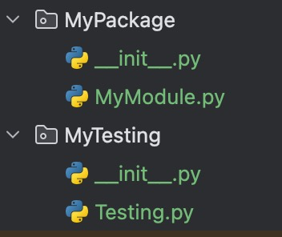

# 包

**`包（Package）`** 是`Python`组织模块的方式。简单来说，**包就是一个包含多个模块的文件夹**，并且**这个文件夹中必须包含一下`__init__.py`文件(Python 3.3之前是必须required/mandatory，后面版本变为可选optional)**

优点：
- **避免模块命名冲突**：不同的包可以有相同名字的模块
- **模块组织更清晰**：便于管理大型项目
- **支持层次结构**：可以创建子包


## 创建包 Package

一个包的架构大致如下：

```bash

mypackage /
|-- __init__.py
|-- module1.py
|-- module2.py
|-- subpackage
	|-- __init__.py
	|-- submodule.py
```


#### `__init__.py` 的作用

- 使`Python`识别 identify `MyPackage`目录为包
- 可以用于**执行初始化代码**，例如导入包内的特定模块

如上图，`MyModule.py`在`MyPackage`包内：

```python
# __init__.py

print('MyPackage is imported.')
```

- 控制`from MyPackage import *`的行为

### 如何在一个包中导入另一个包的模块

需要借助`sys`和`os`两个模块

```python
import sys  
import os  
sys.path.append(os.path.dirname(os.path.dirname(__file__)))  
  
import MyPackage.MyModule as m  
  
print(m.__name__)  
print(__name__)  
print(m.pi)  
print(m.area(10))  
  
s = m.Shape("Circle")  
print(s.myname())
```

## 安装pip

- 安装第三方包，第三方是指除了开发人员本身和已经下载的`Python`之外的人提供的包

```python
pip install requests	
```