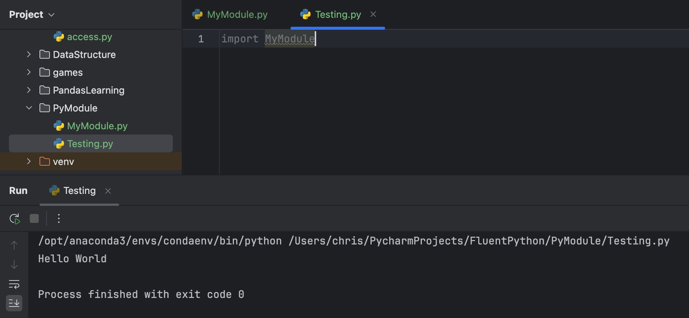

# 模块

**模块(module)** 是一个`Python`文件（扩展名为`.py`），它包含了**函数、类、变量**以及可执行的代码。模块的作用是**代码复用、结构化管理和减少重复代码**。

## 创建模块

要创建一个模块的过程就是写 `Python`程序的过程。比如，将下面代码保存成文件名为`MyModule.py`，那么这个文件就是一个模块:

```python
print("hello, world")
```

对于上面的模块来讲，它的内容很简单，并且是可以**立即**执行的一行代码，这意味着，这个模块在被导入时就会执行。

尝试创建另外一个`Python`文件`Testing.py`，将这个模块导入：

```python
import MyModule
```




## 导入模块

在上一个部分，已经对导入模块有了认识，但是导入模块的方式主要有四种：

- `import module`
```python
import math
print(math.sqrt(16)) # 4.0
```

- `from module import item` (不推荐)

```python
from math import sqrt
print(sqrt(16))
```
这种方式在调用时不需要通过`.`去调用。

- `from module import *` (强烈不推荐)
```python
from math import *
print(sqrt(16))
print(pi)
print(sin(1))
```

**⚠️ 注意**：不推荐使用 `import *`，因为可能会导致名称冲突。

- `import module as alias` （重命名模块）
```python
import math as m
from math import sqrt as s
print(m.sqrt(16))
print(s(16))
```

#### 如何避免模块导入后，执行不必要的代码。

- 第一种方式就是，在编写可能被导入的模块时，不要写那些可以直接被执行的代码，只写需要被调用的**函数、类、变量**。

```python
"""
模块名为 MyModule.py
"""
pi = 3.14

def area(r):
	return r*r*pi

class Shape:

	def __init__(self, type):
		self.type = type

	def myname(self):
		return self.type
```

```python
"""
模块名为 Testing.py
"""
import MyModule as m
"""
如果这个文件到些结束，那么不会执行任何导入模块之外的代码，如果要执行模块中的代码，要在下面调用
"""

print(m.pi)
print(m.area(10))

s = m.Shape("Circle")
print(s.myname())
```

- 通过`if __name__ == '__main__':` 方式将被导入模块内可立即执行的代码限制为只在本模块下执行：
```python
"""
模块名为 MyModule.py
"""
pi = 3.14

def area(r):
	return r*r*pi

class Shape:

	def __init__(self, type):
		self.type = type

	def myname(self):
		return self.type

if __name__ == '__main__':
	print(pi)  
	print(area(10))  
  
	s = Shape("Circle")  
	print(s.myname())
```